## Szacowanie złożoności algorytmów, klasy złożoności problemów algorytmicznych. 
Złożoność algorytmu:
- **Złożoność obliczeniowa** algorytmu jest rozpatrywana jako ilość czasu potrzebnego do rozwiązania problemu w zależności od liczby danych wejściowych. Jest podawana w liczbie wykonanych operacji i jest to największa liczba operacji dominujących wykonywanych w algorytmie dla dowolnego układu danych.
- **Złożoność pamięciowa** algorytmu określa wielkość pamięci operacyjnej komputera, która jest potrzebna do przechowywania danych wejściowych, danych pośrednich oraz ostatecznych wyników obliczeń.

Złożoność czasowa oraz złożoność pamięciowa algorytmu często zależą od postaci przetwarzanych danych, dlatego można je przedstawiać jako złożoność:
- **pesymistyczna** — określa zużycie zasobów dla najgorszego przypadku,
- **oczekiwana** — określa zużycie zasobów dla uśrednionych wszystkich możliwych przypadków lub dla typowych przypadków,
- **optymistyczna** — określa zużycie zasobów dla najkorzystniejszego przypadku.

Złożoność wykonywania różnych algorytmów możemy szacować:
- od dołu stwierdzając, iż złożoność obliczeniowa jest nie mniejsza niż pewna klasa funkcji Ω(f(n))
- asymptotycznie, szacując dokładnie złożoność obliczeniową poprzez pewną klasę funkcji Θ(f(n))
- od góry ograniczając złożoność obliczeniową poprzez pewną klasę funkcji O(f(n))

### Notacja O
Notacja ta zakłada, że istnieje funkcja g(n), dla której spełniona jest poniższa własność:
$$\forall n\geq n_0:f(n) \leq c * g(n)$$
Własność ta oznacza, że wynik funkcji g(n) pomnożony przez jakąś stałą c będzie większy bądź równy wynikowi funkcji f(n).

Przykład:
$$f(n)=2n+3 \Rightarrow f(n) = O(n)$$

$$
\begin{equation}
  \begin{split}
    2n+3 \leq 10n\\ 
	5\leq 10
  \end{split}
\quad\quad
  \begin{split}
   2n+3 \leq 7n\\
   5\leq 7
  \end{split}
  \quad\quad
  \begin{split}
   2n+3 \leq 2n+3n \Rightarrow 2n+3 \leq 5n 
   \\ 5\leq 5
  \end{split}
\end{equation}
$$

Dla każdego z powyższych przykładów funkcją $g(n)$ jest $n$, a zmienna c to odpowiednio, 10, 7 i 5.
Ale prawdą jest również nastepujący zapis:

$$ 2n+3 \leq 2n^2+3n^2 \Rightarrow 2n+3 \leq 5n^2 $$
$$ 5\leq 25$$
wtedy $f(n) = O(n^2)$
* * *
### Notacja Ω
Notacja ta zakłada, że istnieje funkcja g(n), dla której spełniona jest poniższa własność:
$$\forall n\geq n_0:f(n) \geq c * g(n)$$
Własność ta oznacza, że wynik funkcji g(n) pomnożony przez jakąś stałą c będzie mniejszy bądź równy wynikowi funkcji f(n).
Przykład:
$$f(n)=2n+3 \Rightarrow f(n) = \Omega(n)$$
* * *
### Notacja Θ
Można powiedzieć, że notacja Θ to połączenie notacji Ο i Ω. W tym przypadku funkcja użyta do oszacowania musi spełniać zależność:

$$\forall n \geq n_0: c_1 ∗ g(n) \leq f(n) \leq c_2 ∗ g(n)$$
Można powiedzieć, że wynik funkcji g(n) pomnożony przez stałą $c_1$ będzie większy bądź równy wartości funkcji f(n). Jednocześnie będzie mniejszy bądź równy wartości funkcji f(n) jeśli pomnożymy go przez stałą $c_2$.

Przykład:
$$f(n)=2n+3 \Rightarrow f(n) = \Theta(n)$$
$$1*n \leq 2n+3\leq 5*n$$
* * *
### Klasy złożoności
- Ο(1) - złożoność stała - niezależna od liczby danych wejściowych. Mówimy, że problem o złożoności Ο(1) możemy rozwiązać w stałym czasie niezależnie od wielkości danych wejściowych.
- Ο(n) - złożoność liniowa - jest to specyficzny przypadek złożoności wielomianowej. Czas rozwiązania problemu jest wprost proporcjonalny do wielkości danych wejściowych.
- Ο($\log(n)$)- złożoność logarytmiczna - czas rozwiązania zależy od wyniku logarytmu z wielkości danych wejściowych.
- Ο($n \log(n)$) - złożoność liniowo-logarytmiczna - czas rozwiązania problemu jest wprost proporcjonalny do iloczynu wielkości danych wejściowych i ich logarytmu.
- Ο($n^2$)- złożoność kwadratowa
- Ο($n^x$) - złożoność wielomianowa.
- Ο($x^n$)- złożoność wykładnicza
- Ο($n!$) - złożoność typu silnia.

$$ 1 < \log n < \sqrt n < n < n \log n< n^2 <n^3<...<2^n<3^n<n^n$$

## Najważniejsze algorytmy wyszukiwania i sortowania, przegląd i zastosowania. 

### Algorytmy sortowania
#### Bubble sort
Zasada działania opiera się na cyklicznym porównywaniu par sąsiadujących elementów i zamianie ich kolejności w przypadku kiedy, zaburza ona porządek, w jakim sortuje się tablicę. Operację tę wykonujemy dotąd, aż cały zbiór zostanie posortowany.

| Przypadek           | Ilość  zmian | Ilość porównań |
| ------------------- | ------------ | -------------- |
| Najgorszy przypadek | $O(n^2)$     | $O(n^2)$       |
| Najlepszy przypadek | $O(n)$       | $O(1)$         |
| Średni przypadek    | $O(n^2)$     | $O(n^2)$       |

| Cecha                | Wartość       |
| -------------------- | ------------- |
| Złożoność pamięciowa | $O(1)$        |
| Sortowanie w miejscu | Tak           |
| Stabilność algorytmu | Jest stabilny |

#### Selection sort
Zasada działania algorytmu opiera się na wyszukaniu najmniejszego elementu w zbiorze i zamiany go z elementem stojącym na pierwszej pozycji. Następnie szukamy kolejnego najmniejszego elementu  w zbiorze pomniejszonym o element na pierwszej pozycji, po czym wstawiamy go na pozycję drugą. Powtarzamy do momentu otrzymania posortowanej tablicy.

| Przypadek           | Ilość  zmian | Ilość porównań |
| ------------------- | ------------ | -------------- |
| Najgorszy przypadek | $O(n^2)$     | $O(n^2)$       |
| Najlepszy przypadek | $O(n)$       | $O(1)$         |
| Średni przypadek    | $O(n^2)$     | $O(n^2)$       |

| Cecha                | Wartość       |
| -------------------- | ------------- |
| Złożoność pamięciowa | $O(1)$        |
| Sortowanie w miejscu | Tak           |
| Stabilność algorytmu | Nie jest stabilny |

#### Merge sort
Algorytm sortowania przez scalanie opiera się na zasadzie dziel i zwyciężaj. Główna zasada działania polega na rekurencyjnym dzieleniu tablicy na podtablice. Dzielenie kończymy, w którym, każda z podtablic w danej grupie jest tablicą jednoelementową. Łączymy je kolejno, porównując wartości ich elementów. Dokładny przebieg algorytmu wygląda następująco:

Jeśli indeks prawej części tablicy (`rightBound`), jest większy od indeksu lewej (`leftBound`) części tablicy to:

1.  Znajdź środkowy indeks tablicy (`middle`), ze wzoru $middle=(l+r)/2$ 
2.  Wywołaj sortowanie przez scalanie dla podtablicy o indeksach od `leftBound` do `middle`
3.  Wywołaj sortowanie przez scalanie dla podtablicy o indeksach od `middle+1` do `rightBound`
4.  Połącz podtablicę `[leftBound ... middle]` i `[middle+1 ... rightBound] `przyrównując przy tym ich elementy – Jeśli element lewej tablicy na aktualnej pozycji jest mniejszy od tego na prawej, wstaw go do tablicy docelowej i zwiększ indeks lewej tablicy. W przeciwnym przypadku wykonaj analogiczne działanie dla prawej tablicy.

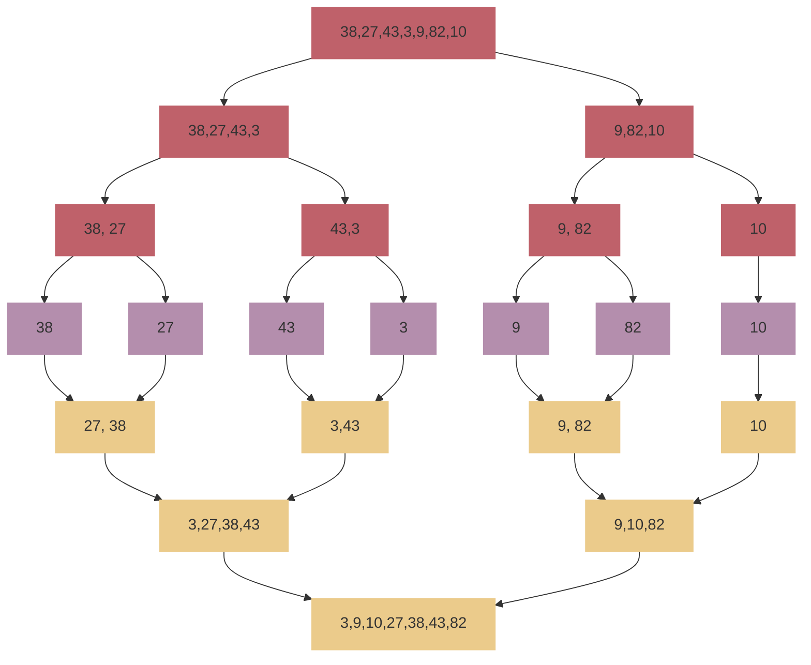


| Przypadek            | Złożoność czasowa |
| -------------------- | ----------------- |
| Najgorszy przypadek  | $O(n log n)$      |
| Najlepszy przypadek  | $O(n)$            |
| Średni przypadek     | $O(n\log\ n)$     |
| Złożoność pamięciowa | $O(n)$            |

| Cecha                | Wartość       |
| -------------------- | ------------- |
| Złożoność pamięciowa | $O(1)$        |
| Sortowanie w miejscu | Nie           |
| Stabilność algorytmu | Jest stabilny |

#### Quick sort
Quick Sort należy do jednego z najszybszych algorytmów sortujących dane. 
Według ustalonego schematu wybierany jest jeden element w sortowanej tablicy, który będziemy nazywać **pivotem.** Następnie ustawiamy elementy nie większe na lewo tej wartości, natomiast nie mniejsze na prawo. W ten sposób powstaną nam dwie części tablicy (niekoniecznie równe), gdzie w pierwszej części znajdują się elementy nie większe od drugiej. Następnie każdą z tych podtablic sortujemy osobno według tego samego schematu.

Algorytm wykorzystuje technikę dziel i zwycieżaj:
- **Dziel:** Tablica A jest 'dzielona' (jej elementy są przestawiane) na dwie niepuste podtablice.
- **Zwyciężaj:** Obie podtablice są sortowane za pomocą rekurencyjnych wywołań algorytmu.
- **Połącz:** Ponieważ podtablice są sortowane w miejscu, nie trzeba nic robić, żeby je połączyć — cała tablica jest już posortowana.

| Przypadek           | Złożoność czasowa |
| ------------------- | ----------------- |
| Najgorszy przypadek | $O(n^2)$          |
| Najlepszy przypadek | $O(n\log\ n)$     |
| Średni przypadek    | $O(n\log\ n)$     |

| Cecha                | Wartość       |
| -------------------- | ------------- |
| Złożoność pamięciowa | $O(1)$        |
| Sortowanie w miejscu | Tak           |
| Stabilność algorytmu | Nie jest stabilny |

##### Najgorszy przypadek
Skuteczność algorytmu Quicksort w dużej mierze zależy od doboru pivotu. Załóżmy, że dane wejściowe funkcji Quicksort to **posortowana tablica i jako pivot wybieramy skrajny lewy element.** W tym przypadku będziemy mieli dwie skrajnie niezrównoważone tablice. Jedna tablica będzie miała jeden element, a druga będzie miała (N-1) elementów. 

Podobnie, gdy dana **tablica wejściowa jest posortowana odwrotnie, a jako element przestawny wybierzemy skrajny prawy element**.

**Unikanie najgorszego przypadku**
- wybór pivota ze środka tablicy. W ten sposób możemy podzielić tablicę wejściową na dwie subtablice o podobnej liczbie elementów.
- wybór losowych losowego pivota - takie działanie przy każdym wywołaniu zmniejszy prawdopodobieństwo osiągnięcia najgorszego przypadku zachowania. Bardziej prawdopodobne jest, że będziemy wybierać pivoty znajdujące się bliżej środka tablicy, a gdy tak się stanie, rekurencja rozgałęzia się bardziej równomiernie, a tym samym algorytm kończy się znacznie szybciej.

Można też przetasować (shuffle) wejściową listę, aby mieć pewność, że na pewno nie będzie posortowana lub prawie posortowana

#### Radix sort
Sortowanie pozycyjne jest stabilnym algorytmem sortowania. Dzięki niemu możemy posortować wyrażenia złożonych z dowolnych znaków. Sortowanie zaczynamy od znaków na pozycjach najmniej znaczących, czyli od ostatnich znaków wyrażenia. Kolejny krok polega, aby posortować wyrażenia według przedostatniego znaku i tak kontynuujemy, aż dotrzemy do pierwszego znaku.

Algorytm sortujący według znaku jest dowolny. Możemy użyć tutaj algorytmu bąbelkowe o złożoności $O(n^2)$ jak również sortowania szybkiego o złożoności $O(n \log n)$.

W przypadku radix sortu złożoność wyniesie $O(d*a)$, gdzie $d$ określa ilu znakowe są porównywane elementy, a $a$ to złożoność czasowa wybranego algorytmu sortowania. Dla połączenia radix sort i count sort złożoność wyniesie $O(d(n+k))$.

### Algorytmy wyszukiwania
#### Wyszukiwanie liniowe
Jest to najprostszy algorytm wyszukiwania o złożoności czasowej $O(n)$

Algorytm wyszukiwania liniowego przechodzi przez każdy element tablicy sekwencyjnie. 
- Jeśli porównywany element nie jest równy szukanemu elementowi, algorytm przechodzi do następnego elementu aż do osiągnięcia końca tablicy. Jeżeli go osiągnie, jest to równoznaczne z informacją, że szukanego elementu nie ma w tablicy.
- Jeżeli porównywany element jest równy z szukanym algorytm zwraca jego indeks i kończy działanie.
- 
##### Wyszukiwanie liniowe z wartownikiem
Liczbę porównań można zredukować wykorzystując algorytm wyszukiwania z wartownikiem. Nazwa tego algorytmu bierze się ze sposobu, w jaki wykorzystywany jest element szukany $x$.  
  
Żeby odnaleźć element $x$ podejmiemy następujące kroki:  
-  na końcu tablicy wstawimy szukany element $x$ - będzie to nasz wartownik,
-   w algorytmie przechodzimy po kolejnych elementach tablicy, tak długo aż nie znajdziemy szukanego elementu,
-   w momencie znalezienia szukanego elementu $x$ sprawdzamy, który jest to element tablicy? Jeżeli jest to ostatni element tablicy (_n+1_) to trafiliśmy na naszego wartownika i oznacza to, że w tablicy nie było szukanego elementu $x$, w przeciwnym razie element $x$ został odnaleziony.
#### Wyszukiwanie binarne
Algorytm szuka danego elementu w **uporządkowanej** (posortowanej) tablicy. Jest to szybki algorytm wyszukujący o złożoności czasowej $O(log \ n)$ realizujacy strategię dziel i zwycieżaj. Dzieli on tablicę na mniejsze podtablice do momentu wyszukania pozycji (lub nie w przypadku gdy taki element nie istnieje) elementu szukanego.

Wykorzystuje 3 zmienne pomocnicze:
- left − przechowuje lewy koniec przeszukiwanego zakresu,
- right − przechowuje prawy koniec przeszukiwanego zakresu,
- middle - przechowuje środek przeszukiwanego zakresu.

##### Zasada działania
Wyszukiwanie binarne wykorzystuje fakt, że jeśli szukany element jest większy od pewnego elementu $e$ na liście, to wszystkie wartości przed elementem $e$ też są mniejsze od szukanej wartości.

Załóżmy, że szukamy liczby 31.

| lower limit (left) | upper limit(right) | $mid=left + \lfloor {left+right\over 2} \rfloor$ | 
|:------------------:|:------------------:|:------------------------------------------------:|
|         0          |         9          |                        4                         |
|         5          |         9          |                        7                         |
|         5          |         6          |                        5                         |

Najpierw wyznaczymy połowę tablicy za pomocą tego wzoru: $$\large middle=left + \lfloor {left+right\over 2} \rfloor = 0 + \lfloor {0+9\over 2} \rfloor = 4$$

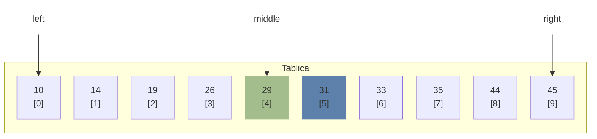
Teraz porównujemy wartość przechowywaną na indeksie 4 z wartością szukaną. Ponieważ wartość 31 jest większa niż 27 i mamy posortowaną tablicę wiemy, że wartość docelowa musi znajdować się w górnej części tablicy.

Zmieniamy `left = middle + 1` i ponownie znajdujemy nowy środek powstałego zakresu wartość.

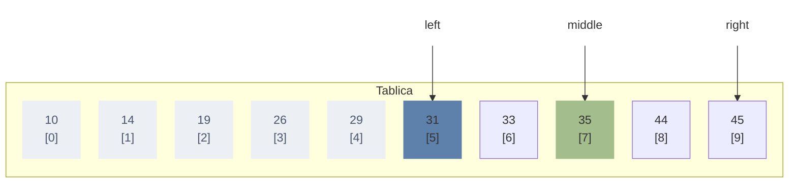

Tym razem wartość wskazana przez `middle` jest większa niż szukany element więc zmieniamy `right = middle - 1`.

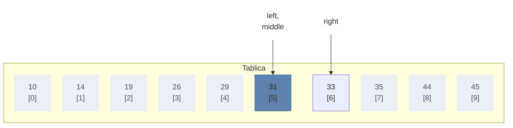
Kontynuujemy dopóki nie `middle` nie wskaże poprawnej wartości, albo `right` nie wskaże indeksu mniejszego niż `left` - wtedy szukanego elementu nie ma w tablicy.

#### Algorytm turniejowy 
Założenia: 
- ciąg jest nieuporządkowany, 
- wszystkie elementy są różne

Ideą tego rozwiązania jest porównywanie elementów w sposób turniejowy – dzielimy elementy na pary, porównujemy każdą parę, a następnie w ten sam sposób porównujemy zwycięzców każdej pary. 

Zaczynamy od wyznaczenia największej liczby w tablicy. Budujemy drzewo z zasadą "przechodzi tylko wygrywający" (większy element). Aby znaleźć drugi co do wielkości element, korzystamy z wiedzy, element ten wygrywa porównania ze wszystkimi innymi elementami z wyjątkiem największego. 

Oznacza to, że był już porównywany z największym elementem w jednym z kroków i musi być największym elementem ze zbioru przegranych (zawierającym log(n) elementów). 

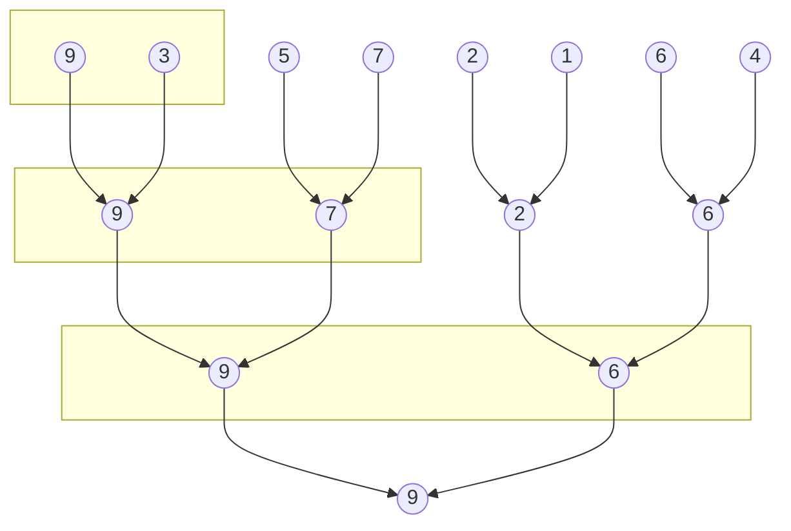

##### Minimalna porównań
Jeśli liczba elementów w tablicy jest potęgą 2, (n = 2ᵏ), to aby znaleźć największy element, należy wykonać $n-1$ porównań przy czasie wykonania $O(n)$. Ponowne wyszukanie największego elementu to $\lceil log(n) \rceil -1$ przy czasie wykonania $O(log(n))$. Więc łączny koszt wykonania dla drugiego co do wielkości elementu to $n + \lceil log(n) \rceil -2$ porównań i $O(n) + O(log(n)) = O(n)$ czasu

#### Wybór elementu k-tego co do wielkości
##### Używając sortowania
Zbiór elementów sortujemy rosnąco. Wtedy elementy ułożą się w kolejności od najmniejszego do największego. Wystarczy zatem zwrócić wartość k-tego od końca elementu.

Ponieważ znajdowanie k-tego największego elementu w zbiorze posortowanym posiada stałą klasę złożoności obliczeniowej $O(1)$, to faktyczna klasa złożoności całego rozwiązania zależy od zastosowanego algorytmu sortującego.

##### Używając Max Heap
Ten problem można łatwo rozwiązać przy użyciu sterty.

Możemy k razy pobrać maksymalny element ze sterty, a ostatni wyodrębniony element będzie k-tym największym elementem. Każda operacja zdejmowania największego elementu zajmuje czas $O(log\ n)$ więc całkowita złożoność czasowa tego podejścia wynosi $O(k \ * \ log\ n )$.

##### Używając algorytmu Quickselect (algorytmy Hoare'a)
Algorytm Hoare'a opiera się na podobnym pomyśle co algorytm quick sort mianowicie na podziale zbioru na liczby mniejsze i większe od wybranego elementu.

Jednak zamiast rekurencji w obie strony, jak w quicksort, quickselect przeszukuje tylko część tablicy z elementami, w których znajduje się szukany element. Zmniejsza to średnią złożoność z $O(n log n)$ do $O(n)$, z najgorszym przypadkiem $O(n^2)$

###### Zasada działania
W zbiorze wybieramy dowolny element. Oznaczmy go jako pivot. Następnie dokonujemy podziału zbioru na dwa podzbiory — lewy i prawy. 
- W podzbiorze **lewym** powinny znaleźć się elementy o wartościach nie większych od pivota. 
- Z kolei w podzbiorze **prawym** powinny być elementy o wartościach nie mniejszych od pivota. Sam pivot musi być pierwszym elementem podzbioru prawego. 

Po takim podziale sprawdzamy, czy pivot  jest (n-k)-tym elementem zbioru. Jeśli tak, to pivot  jest k-tym największym elementem w tym zbiorze. Jeśli nie, to za nowy zbiór do podziału przyjmujemy ten z podzbiorów lewego lub prawego, w którym występuje pozycja (n-k)-ta i całą procedurę powtarzamy aż do znalezienia k-tego największego elementu.

**Najlepszy przypadek**
Kiedy pierwszy wybrany pivot jest k-tym elementem. Wtedy podział wejściowej tablicy występuje tylko raz, a to prowadzi do złożoności $O(n)$

**Średni przypadek**
Średnio podział po każdym kroku powinien ignorować połowę zbioru danych. Po pierwszym przedziale rekursywanie przeszukujemy górny lub dolny przedział. Złożoność w takim wypadku osiąga wartość: $T(n) = 2n \approx O(n)$

**Najgorszy przypadek**
Pojawia się kiedy zbiór jest dzielony na dwa podzbiory o wielkości 1 i n-1. W konsekwencji należy wykonać  jeszcze n-1 kolejnych wywołań rekurencyjnych co prowadzi do złożoności: $T(n) \approx O(n^2)$
##### Algorytm Buma-Floyda-Pratta-Rivesta-Trajana ( algorytm BFPRT)
Jest znany również jako algorytm **mediany median** lub **magicznych piątek**.

Pomysł polega na ulepszeniu algorytmu Hoare’a, mianowicie na dokonaniu podziału względem sensownego elementu i to tym razem na trzy zbiory, mniejszych, równych oraz większych od wybranej liczby.

Idea algorytmu BFPRT  polega na tym, żeby znaleźć w zbiorze A taki element, który zapewni podział na stosunkowo równe zbiory elementów mniejszych ($A_{<}$) i większych ($A_{>}$).
###### Zasada działania
 1. dzielimy ciąg A na 5-elemenetowe podciągi $P_{1} ... P_{\lceil |A|/5 \rceil}$
 2. Każdy podciąg sortujemy
 3. Z każdego z nich wybieramy 3-ci co do wielkości element otrzymując ciąg median M
 4. Jako pivot wybieramy medianę ciągu M
###### Złożoność
Niech $T(n)$ oznacza złożoność czasową algorytmu. Wykonanie algorytmu składa się z trzech etapów. 
1. Znajdowanie median piątek w czasie $O(n)$. 
2. Znajdowanie rekurencyjne mediany median w czasie $T({n\over5})$. 
3. Wykonania rekurencyjnego w czasie $T({3n\over4})$. 

To ostatnie oszacowanie wynika z faktu, że przynajmniej $\large 1 \over 4$ elementów jest nie większa od mediany median M, a więc $\large 3 \over 4$ elementów jest większa lub równa M. Podobnie przynajmniej $\large 1 \over 4$ elementów jest nie mniejsza od M, czyli $\large 3 \over 4$ elementów jest mniejsza lub równa M.

Całkowite oszacowanie ma postać $T(n) <= O(n) + T({n\over5}) + T({3n\over4})$, co daje rozwiązanie postaci $T(n) = O(n)$ 

## Charakterystyka i zastosowania podstawowych struktur danych: stos, kolejka, kolejka priorytetowa, struktura Find-Union, słownik.
### Stos
Stos to abstrakcyjny typ danych, który przechowuje uporządkowaną, liniową sekwencję elementów. Jako użytkownik mamy dostęp tylko do elementu, który znajduje się na szczycie stosu. Aby ściągnąć elementy stosu poniżej wierzchołka, trzeba najpierw po kolei ściągnąć to, co jest nad nimi.

#### Operacje na wykonywane na stosach
- push(wartość) - dodanie elementu na stos
- pop() - zdjęcie elementu ze stosu
- empty() - sprawdzenie, czy stos jest pusty
- size() - zwrócenie liczby elementów na stosie
- top()/peek() - zwrócenie wartości znajdującej się na szczycie stosu bez zdejmowania jej 

#### Implementacja statyczna z użyciem tablicy 
W przypadku tablicy  pierwszy element tablicy, który znajduje się na indeksie 0, będzie dnem stosu. Stos będzie miał stałą pojemność, co oznacza, że ciągłe dodawanie elementów do stosu spowoduje **przepełnienie stosu** (stack overflow) . Z tego powodu implementacje statyczne muszą zawierać operację `is_full()`. Podobnie może wystąpić **niedopełnienie stosu** (stack underflow), jeśli będziemy próbować usunąć elementy z pustego stosu.

Ponieważ wierzchołek stosu zmienia się za każdym razem, gdy zostanie dodany lub usunięty element, pozycja indeksu wierzchołka stosu musi być przechowywana w dodatkowej zmiennej.

#### Implementacja dynamiczna z użyciem listy
Stos może być zaimplementowany dynamicznie za pomocą listy wiazanej. W takim przypadku nowe elementy zostaną dodane na **początku**  listy, więc `head` listy może służyć jako wskaźnik szczytu stosu. Kiedy `head`jest **wskaźnikiem pustym** (tzn. nie wskazuje na nic), stos jest pusty. Jeśli rozmiar stosu musi być ograniczony, można użyć dodatkowej zmiennej do śledzenia liczby elementów na stosie.

### Kolejki priorytetowe (Priority Queue)
Kolejka priorytetowa to struktura danych służąca do przechowywania zbioru elementów, z których każdy ma przyporządkowaną wartość zwaną **kluczem**. Elementy w kolejce priorytetowej nie są ułożone w kolejności wprowadzania tylko według przyporządkowanych priorytetów. 

Kolejka priorytetowa jest abstrakcyjnym typem danych. Istnieją różne implementacje tej idei, różniące się czasem działania, kosztem i innymi cechami:
- Listy
- Sterty
- Drzew binarnych

Kolejki priorytetowe typu max są używane m.in. do szeregowania procesów w jądrach systemów operacyjnych lub w algorytmie Dijkstry wyznaczania najkrótszych ścieżek w grafach.

Kolejka ma początek (głowę) oraz koniec (ogon). Kiedy wstawiamy nowy element do kolejki, zostaje on umieszczony na jej końcu. Element może zostać usunięty z kolejki tylko wtedy, gdy znajduje się na jej początku.

#### Operacje na wykonywane na kolejkach
Oferuje ona następujące operacje:
-   Enqueue(H,x): wstawia element x do kolejki H;
-   FindMax(H): zwraca element o największym kluczu w kolejce H;
-   ExtractMax(H): zwraca element o największym kluczu w kolejce H, usuwając go przy tym z H.
-   DecreaseKey(H,x,y): nadaje kluczowi elementu x w kolejce H nową, mniejszą wartość y;
-   Dequeque(H,x): usuwa element x z kolejki H.
-   Merge(H1,H2): zwraca nową kolejkę, zawierającą wszystkie elementy z kolejek H1 i H2, niszcząc je przy tym;
## Drzewa binarne i drzewa n-arne w algorytmice. Charakterystyka, sposoby implementacji i zastosowania.
### Drzewo
Drzewa są nieliniowymi abstrakcyjnymi strukturami danych używanymi do reprezentowania danych uporządkowanych hierarchicznie. Są one szczególnym przypadkiem grafów.

Drzewa są zbudowane z węzłów (nodes). W węzłach przechowywane są dane. Węzły połączone są w sposób hierarchiczny za pomocą krawędzi. Drzewa **nie mają cykli** ani **nie posiadają kilku alternatywnych dróg pomiędzy tymi samymi wierzchołkami**. 

>[!info] Cykl to nietrywialna droga posiadająca początek i koniec w tym samym wierzchołku.
 
#### Przodek i potomek
- Każdy węzeł _y_ na ścieżce z korzenia do węzła _x_ nazywamy **przodkiem** węzła x. 
- Jeżeli _y_ jest przodkiem _x_, to _x_ jest **potomkiem** _y_.
- Jeżeli $x \neq y$ to _y_ jest **właściwym przodkiem** _x_, a _x_ jest **właściwym potomkiem** _y_.

#### Poddrzewo
**Poddrzewo** o korzeniu _x_ jest drzewem utworzonym z potomków _x_, którego korzeniem jest węzeł _x_.

#### Poprzednik i następnik
- Jeżeli ostatnią krawędzią drzewa T na ścieżce od korzenia do węzła _x_ jest (y, x), to _y_ jest **poprzednikiem** (ojcem) _x_, a _x_ jest **następnikiem** (synem) _y_.
- Jeżeli dwa węzły mają ten sam poprzednik, to nazywamy je braćmi. 

#### Liście 
- Węzeł, który** nie ma** następników jest **węzłem zewnętrznym** lub **liściem**. 
- Węzeł, który **nie jest** liściem, jest **węzłem wewnętrznym**.

#### Wysokość drzewa
Długość ścieżki od korzenia do węzła nazywa się głębokością węzła w drzewie. Największa głębokość węzła w drzewie jest jego wysokością.

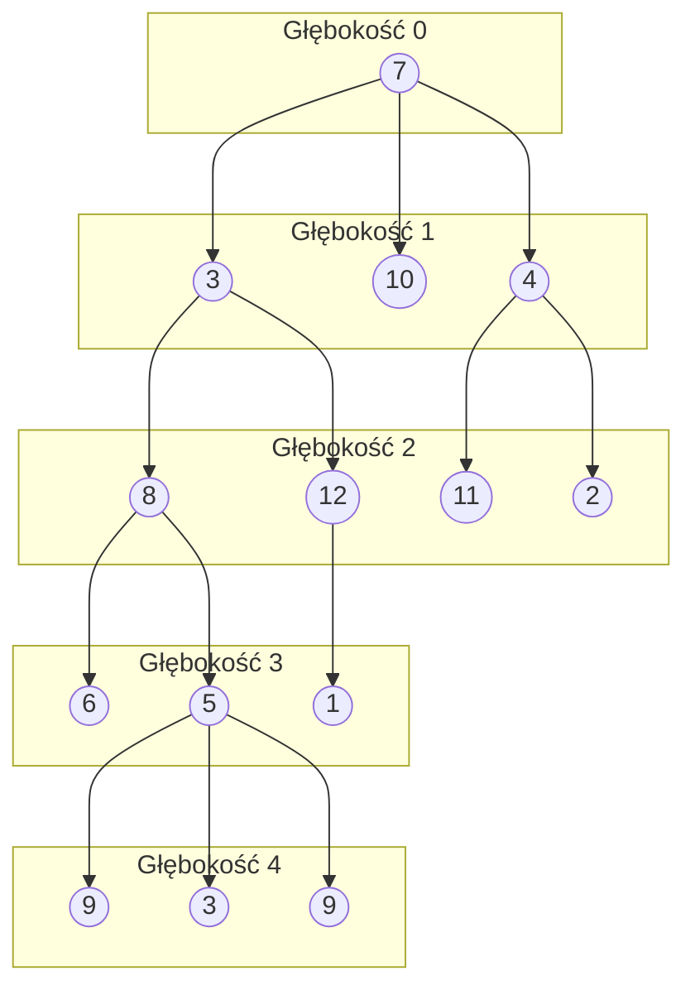
Powyższe drzewo ma wysokość = 4;
***
### Drzewa binarne
Drzewo, w którym liczba synów każdego wierzchołka wynosi **nie więcej** niż dwa, nazywamy drzewem binarnym. Wyróżnia się wtedy **lewego syna** i **prawego syna** danego wierzchołka.

#### Implementacja drzew binarnych
Wierzchołek drzewa definiujemy jako obiekt klasy TreeNode:

```c++ 
template<typename T>
struct TreeNode {
	struct TreeNode *left, *rigth;
	T value;
}
```

Dodawanie nowego węzła:
```c++
template<typename T>
TreeNode* addNewNode(T value){
	TreeNode* newNode = new TreeNode;
	newNode->value = value;
	newNode->left = newNode->right = NULL;
	return newNode;
}
```

#### Poruszanie się po drzewie binarnym
**Złożoność czasowa**
Niech $T(v)$ będzie liczbą operacji przechodzenia przez wierzchołek drzewa binarnego o korzeniu w wierzchołku $v$ dla funkcji `printPreorder`, wtedy

$$
T(v, n)=
\begin{cases}
0 & \text{dla }root = NULL\\
T(v.left, n) + T(v.right, n) + 3 & \text{dla }root \neq NULL
\end{cases}
$$

Stąd $T(v, n) = 3n = \Theta(n)$

**Przechodzenie drzewa metodą preorder**
 Klucz korzenia zostaje wypisany przed wypisaniem wartości znajdujących się w obu poddrzewach.
 
**Przechodzenie drzewa metodą inorder** 
Klucz korzenia zostaje wypisany między wartościami jego lewego poddrzewa a wartościami jego prawego poddrzewa.

**Przechodzenie drzewa metodą postorder** 
Klucz korzenia zostaje wypisany po wypisaniu wartości znajdujących się w obu poddrzewach.

#### Rodzaje drzew binarnych
##### Pełne Drzewo Binarne (Full Binary Tree)

Jest to specjalny rodzaj drzewa binarnego, w któryn wszystkie węzły powinny mieć albo dwa węzły podrzędne, albo nie mieć ich wcale.Innymi słowy, pełne drzewo binarne jest unikalnym drzewem binarnym, w którym każdy węzeł z wyjątkiem węzła zewnętrznego ma dwoje dzieci.

Jeżeli wysokość drzewa to h, to drzewo ma maksymalnie $2^{h+1}-1$ węzłów.

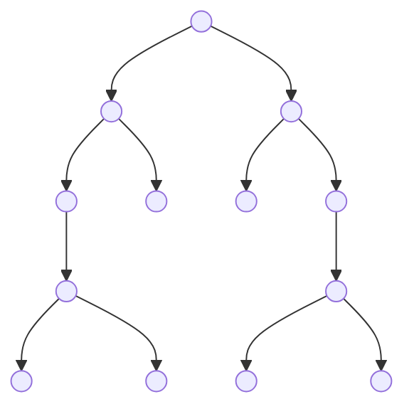

##### Kompletne Drzewo Binarne (Complete Binary Tree)
Kompletne drzewo binarne to inny specyficzny rodzaj drzewa binarnego, w którym wszystkie poziomy drzewa są całkowicie wypełnione węzłami, z wyjątkiem najniższego poziomu drzewa. Również na ostatnim lub najniższym poziomie tego drzewa binarnego każdy węzeł powinien znajdować się po lewej stronie.

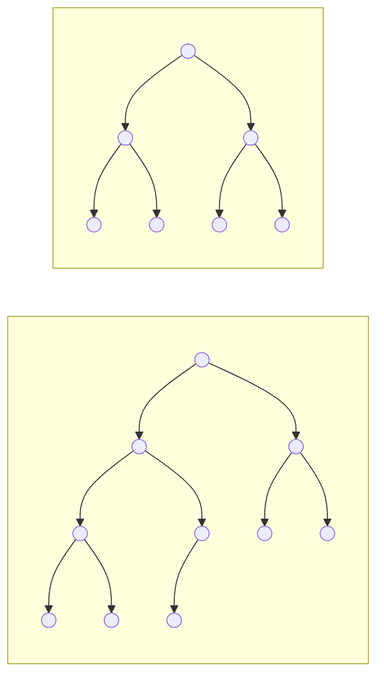

| Własność kompletnego drzewa binarnego | Wzór określający                       |
| ------------------------------------- | -------------------------------------- |
| Maksymalna ilość węzłów               | $\large 2^{h+1}-1$                     |
| Minimalna ilość węzłów                | $\large 2^h$                           |
| Maksymalna wysokość                   | $\large \log_2 n$                      |
| Minimalna wysokość                    | $\large \lceil \log_2 (n+1) \rceil -1$ |

##### Idealne Drzewo Binarne (Perfect Binary Tree)
Mówi się, że drzewo binarne jest „idealne”, jeśli wszystkie węzły wewnętrzne mają dokładnie dwoje dzieci, a każdy węzeł zewnętrzny lub liść znajduje się na tym samym poziomie lub tej samej głębokości w drzewie. Idealne drzewo binarne o wysokości h ma $2h – 1$ węzeł.

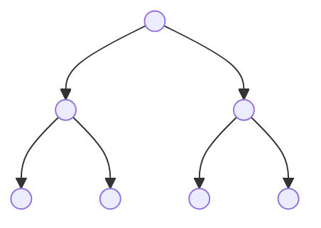

##### Zrównoważone Drzewo Binarne (Balanced Binary Tree)
Mówi się, że drzewo binarne jest „zrównoważone”, jeśli wysokość drzewa wynosi $O(log n)$, gdzie n jest liczbą węzłów. W zrównoważonym drzewie binarnym wysokość lewego i prawego poddrzewa każdego węzła powinna różnić się najwyżej o jeden.

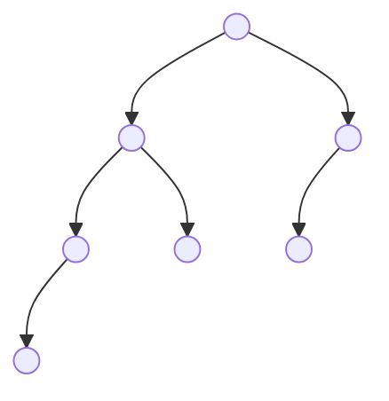

##### Zdegenerowane Drzewo Binarne (Degenerate Binary Tree)
Mówi się, że drzewo binarne jest zdegenerowanym drzewem binarnym lub patologicznym drzewem binarnym, jeśli każdy węzeł wewnętrzny ma tylko jedno dziecko.

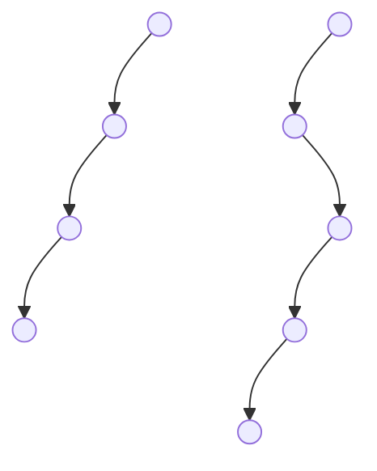

### Użycie drzew
- struktury wyszukujące, w których dane stale wchodzą/wychodzą, np. mapy i obiekty ustawione w bibliotekach wielu języków.
 - używana w prawie każdej grze wideo 3D w celu określenia, które obiekty wymagają renderowania (binary space partition).
-  używane do implementowania wydajnych kolejek priorytetowych (w formie sterty), które z kolei są wykorzystywane do planowania procesów w wielu systemach operacyjnych, kontroli jakości usług w routerach i A* (algorytm wyszukiwania ścieżek używany w aplikacjach AI, w tym w robotyce i grach wideo).
 -  używane w algorytmach kompresji (kodowanie Huffamana), takich jak te używane w formatach plików .jpeg i .mp3.
-  używane w aplikacjach kryptograficznych do generowania drzewa liczb pseudolosowych (drzewa GGM).
- drzewa składniowe tworzone przez kompilatory i (domyślnie) kalkulatory do analizowania wyrażeń.
- bazy danych korzystają z jakiejś formy drzewa B do przechowywania danych na dysku.
## Algorytmy rekurencyjne vs algorytmy iteracyjne, porównanie i omówienie podstawowych założeń konstrukcyjnych.
Algorytmy rekurencyjne i iteracyjne to dwie główne kategorie algorytmów, różniące się podejściem do rozwiązania problemu.

**Algorytmy rekurencyjne:**
1. **Definicja:** Algorytmy rekurencyjne opierają się na zasadzie rozwiązania problemu poprzez podzielenie go na mniejsze, podobne instancje tego samego problemu.
2. **Wywołanie rekurencyjne:** Algorytmy rekurencyjne często zawierają wywołanie samego siebie dla mniejszych podproblemów.
3. **Warunek bazowy:** Każde rekurencyjne wywołanie musi skończyć się warunkiem bazowym, czyli sytuacją, dla której nie jest już konieczne dalsze dzielenie problemu.

**Algorytmy iteracyjne:**
1. **Definicja:** Algorytmy iteracyjne opierają się na pętlach i powtarzaniu zestawu instrukcji w określony sposób.
2. **Pętle:** Wykorzystują pętle, takie jak `for` lub `while`, do wielokrotnego wykonania zestawu instrukcji.
3. **Brak wywołań rekurencyjnych:** Nie korzystają z wywołań samego siebie, co odróżnia je od algorytmów rekurencyjnych.

**Porównanie:**
- **Złożoność pamięciowa:** Algorytmy rekurencyjne mogą wymagać dodatkowej pamięci na stosie dla każdego wywołania rekurencyjnego, co może prowadzić do przepełnienia stosu przy dużych głębokościach rekurencji. Algorytmy iteracyjne zazwyczaj mają mniejsze wymagania pamięciowe.
- **Złożoność czasowa:** Oba rodzaje algorytmów mogą osiągać tę samą złożoność czasową dla wielu problemów. Jednak niektóre problemy naturalnie lepiej pasują do jednego z podejść.
- **Zrozumienie i czytelność:** Czasami algorytmy rekurencyjne są bardziej naturalne do zrozumienia, zwłaszcza gdy problem jest naturalnie podzielony na podproblemy.