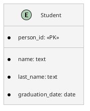
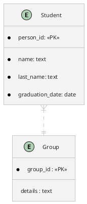
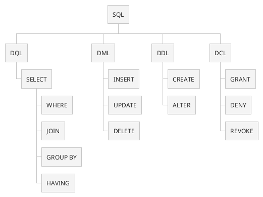

- [[#Podstawowe cechy relacyjnych baz danych.|Podstawowe cechy relacyjnych baz danych.]]
- [[#Podstawowe elementy i znaczenie diagramów związków encji oraz zasady  prawidłowego projektowania schematów bazy danych.|Podstawowe elementy i znaczenie diagramów związków encji oraz zasady  prawidłowego projektowania schematów bazy danych.]]
- [[#Mechanizm współbieżności pracy wielu użytkowników w systemie zarządzania bazami danych.|Mechanizm współbieżności pracy wielu użytkowników w systemie zarządzania bazami danych.]]
	- [[#Mechanizm współbieżności pracy wielu użytkowników w systemie zarządzania bazami danych.#Poziomy izolacji|Poziomy izolacji]]
	- [[#Mechanizm współbieżności pracy wielu użytkowników w systemie zarządzania bazami danych.#Blokady|Blokady]]
	- [[#Mechanizm współbieżności pracy wielu użytkowników w systemie zarządzania bazami danych.#Blokady wielo-poziomowe|Blokady wielo-poziomowe]]
- [[#Podstawowe obiekty, konstrukcje i znaczenie języka SQL.|Podstawowe obiekty, konstrukcje i znaczenie języka SQL.]]
	- [[#Podstawowe obiekty, konstrukcje i znaczenie języka SQL.#Dialekty SQL|Dialekty SQL]]
	- [[#Podstawowe obiekty, konstrukcje i znaczenie języka SQL.#Instrukcje COMMIT i ROLLBACK|Instrukcje COMMIT i ROLLBACK]]
	- [[#Podstawowe obiekty, konstrukcje i znaczenie języka SQL.#Having|Having]]
	- [[#Podstawowe obiekty, konstrukcje i znaczenie języka SQL.#Łączenie tabel w SQL|Łączenie tabel w SQL]]
	- [[#Podstawowe obiekty, konstrukcje i znaczenie języka SQL.#Funkcje agregujące|Funkcje agregujące]]
	- [[#Podstawowe obiekty, konstrukcje i znaczenie języka SQL.#CASE|CASE]]
- [[#Podstawowe zasady optymalizacji zapytań, w tym rodzaje i znaczenie indeksów w bazie danych.|Podstawowe zasady optymalizacji zapytań, w tym rodzaje i znaczenie indeksów w bazie danych.]]
	- [[#Podstawowe zasady optymalizacji zapytań, w tym rodzaje i znaczenie indeksów w bazie danych.#Ogólne zasady optymalizacji|Ogólne zasady optymalizacji]]
	- [[#Podstawowe zasady optymalizacji zapytań, w tym rodzaje i znaczenie indeksów w bazie danych.#Indeksy w bazie danych|Indeksy w bazie danych]]
		- [[#Indeksy w bazie danych#Rodzaje indeksów|Rodzaje indeksów]]

## Podstawowe cechy relacyjnych baz danych.
Relacyjna baza danych to rodzaj bazy danych, który pozwala przechowywać powiązane ze sobą elementy danych i zapewnia do nich dostęp.

W modelu relacyjnym, strukturą danych jest relacja; Relacja jest dwuwymiarową tabelą składająca się z kolumn - **atrybutów** i wierszy - **rekordów**. Każdy **rekord** ma przypisany **unikatowy identyfikator** nazywanym **kluczem**. Kolumny tabeli zawierają **atrybuty danych**, a każdy rekord zawiera zwykle wartość dla każdego atrybutu.

Każda relacja posiada swój tzw. schemat, który składa się z listy atrybutów. Schemat relacji _R_ jest często oznaczany jako _R(A1, A2, ..., An)_, gdzie _A1, A2, ..., An_ oznaczają atrybuty. Liczbę atrybutów składających się na schemat relacji _R_ nazywamy stopniem relacji. Każdy atrybut posiada swoją **domenę**, zwaną także dziedziną. Definiuje ona zbiór wartości jakie może przyjmować atrybut poprzez określenie tzw. typu danych, np. liczba całkowita, data, ciąg znaków o długości.

**Pozostałe cechy relacyjnego modelu baz danych:**
- Poprzez użycie kombinacji „wartość klucza podstawowego, nazwa tabeli i nazwa kolumny” musi istnieć dostęp do dowolnych danych.
- Musi być obsługiwana wartość NULL (wartość NULL przedstawia brakujące lub bezużyteczne informacje, na przykład nieznany numer telefonu).
- Integralność danych powinna być naturalną cechą projektu bazy danych.
	- W modelu relacyjnym danych występują następujące rodzaje **więzów integralności**:
		- **Integralność encji** — każdy schemat relacji posiada klucz główny i żaden element klucza głównego nie może posiadać wartości pustej (NULL).
		- **Integralność referencyjna** — każda wartość klucza obcego jest równa wartości klucza właściwego określonej krotki w relacji nadrzędnej lub wynosi NULL.
		- **Więzy ogólne** — dodatkowe warunki dotyczące poprawności danych określane przez użytkowników lub administratorów baz danych.
- Model relacyjny oznacza, że logiczne struktury danych — tabele danych, widoki i indeksy — są oddzielone od fizycznych struktur pamięci.

## Podstawowe elementy i znaczenie diagramów związków encji oraz zasady prawidłowego projektowania schematów bazy danych.

**CASE (Computer Aided System Engineering)** – narzędzia graficzne do projektowania i rysowania diagramów na ekranie komputera, generowania schematu bazy danych itp.

**Diagram związków encji** – diagram służący do przedstawienia modelu danych z pominięciem szczegółów technicznych związaną z implementacją danych w konkretnym systemie.

Diagram związków encji powinien:
- Jednoznacznie określać wymagania użytkowników i pozwolić im sprawdzić, czy analityk systemu dobrze zrozumiał ich intencje i specyfikę działania firmy
- Być istotnie prostszy od schematu bazy danych (ponieważ pomija szczegóły implementacyjne, którymi zajmuje się projektant baz danych)

### Elementy diagramu związków encji
**Encja** – obiekt, coś co istnieje, co jest odróżnialne od innych, o czym informację trzeba znać lub przechowywać. Encje reprezentowane są ramką:


**Atrybut** – właściwość encji danego typu, opisywana pewną wartością (liczba całkowita, napis, data itp.). Zbiór atrybutów opisuje encję, a zbiór konkretnych wartości atrybutów opisuje instancję encji. **Dla pierwszej postaci normalnej:** **każdy atrybut powinien mieć pojedynczą, atomową wartość**

**Klucz** – jednoznaczny identyfikator instancji danej encji (jak w bazach relacyjnych, jest główny i alternatywne). **Encje słabe\zależne** – takie, które w kluczu głównym mają klucz obcy

**Typy zmiennych (dziedziny atrybutów)** – zbiory wartości, które mogą być przyjmowane przez zmienne zapisywane w kolumnach tabel

**Więzy spójności** – w MS Visio są to wyrażenia określające możliwe wartości danego atrybutu, tak jak w relacyjnych bazach danych (na diagramie pojawiają się przy atrybucie w klamerkach)

**Indeksy** – atrybut lub ich grupa, względem której wyszukiwane są egzemplarze encji (o indeksach więcej w zagadnieniu 15)

**Związek** – uporządkowana lista encji określająca pewną zależność między zbiorami instancji encji. 
- **Związek binarny** – łącząca dwie encje. Ten przykład to też **związek jednoznaczny** (czyli „jeden-do-wiele” – po kluczu obcym widzimy, że jeden student należy do jednej grupy, ale w jednej grupie może być wielu studentów)

- **Nie/identyfikujący** – wartość klucza obcego po stronie stroje jeden nie/wchodzi w skład klucza głównego
- **Niejednoznaczny** – związek typu „wiele-do-wielu”, wymaga stworzenia **encji asocjacyjnej**
- **Rekurencyjny –** zachodzący między tą samą encją (np. jedna osoba jest szefem innej osoby)
- **Jedno-jednoznaczny** – typu „jeden-do-jeden”

Zasady prawidłowego projektowania:
- Prosty i czytelny schemat: powinien być łatwy do zrozumienia przez użytkowników i projektantów.
- Poprawność logiczna: powinien odpowiadać rzeczywistym relacjom pomiędzy encjami.
- Odpowiednie określenie typów związków: powinny być odpowiednio oznaczone, aby zapewnić poprawne odwzorowanie relacji.
- Normalizacja danych: powinna być zachowana, aby uniknąć redundancji danych i zapewnić integralność danych.
- Elastyczność i skalowalność: powinien być zaprojektowany tak, aby mógł być łatwo rozszerzany i dostosowywany do zmieniających się potrzeb biznesowych
## Mechanizm współbieżności pracy wielu użytkowników w systemie zarządzania bazami danych.

>[!info] Poprawność i spójność
Transakcja jest poprawna, jeśli wykonywana w izolacji od innych transakcji, przekształca spójny stan bazy danych w spójny stan bazy danych.

W zależności od stopnia izolacji transakcji, na serwerze mogą występować następujące problemy:
- **Utrata aktualizacji** – pojawia się, gdy dwie transakcje modyfikują te same dane. Transakcja, która zakończy się później, zmodyfikuje dane, usuwając zmiany dokonane przez transakcję, zakończoną wcześniej.
- **Brudne odczyty** – występują, gdy jedna transakcja dokonuje zmian danych, a druga w tym czasie odczytuje te dane. W efekcie transakcja odczytuje dane, które nie zostały 
- **Odczyty widma** – mają miejsce, gdy pomiędzy dwoma odczytami tych samych danych w ramach jednej transakcji zmieni się liczba odczytywanych wierszy (na przykład w wyniku wykonania w międzyczasie instrukcji INSERT lub DELETE na tych danych).

### Poziomy izolacji
| Poziom izolacji  | Niezatwierdzony odczyt | Niepowtarzalny odczyt | Fantomy |
| ---------------- | ---------------------- | --------------------- | ------- |
| READ UNCOMMITED  | TAK                    | TAK                   | TAK     |
| READ COMMITED    | NIE                    | TAK                   | TAK     |
| REPEATABLE READS | NIE                    | NIE                   | TAK     |
| SERIALIZABLE     | NIE                    | NIE                   | NIE     |

Istnieją cztery poziomy izolowania transakcji, które umożliwiają nam zmianę sposobu nakładania blokad przez serwer bazodanowy:
- **READ UNCOMMITED** (odczyt niezatwierdzonych danych)— najniższy poziom, zezwala na czytanie niepotwierdzonych danych. Pozwala na brudne odczyty, niepowtarzalne odczyty i odczyty widma.
- **READ COMMITED** – (odczyt zatwierdzonych danych)— aplikacja może odczytywać tylko potwierdzone dane. Właściwy poziom izolacji np. dla procedur raportujących, dla których istotnych jest chwilowy stan bazy danych. Pozwala na niepowtarzalne odczyty i odczyty widma.
- **REPEATABLE READ** (powtarzalny odczyt) — blokuje dostęp do wszystkich odczytywanych danych. Właściwy poziom izolacji dla procedur odczytu i aktualizacji danych. Pozwala na odczyty widma.
- **SERIALIZABLE** (tryb szeregowania)— blokuje dostęp do tabeli. Właściwy poziom izolacji dla procedur odczytu i aktualizacji danych. Chroni bazę danych przed wszystkimi możliwymi problemami podczas pracy z danymi.

### Blokady
Podstawowym mechanizmem zapobiegającym konfliktom przy współbieżnie wykonywanych transakcjach są blokady (nazywane też zamkami) zakładane na obiekty. 
-  **Typ S** - współdzielona (ang. shared lock) – daje transakcji współdzielony dostęp do zasobu, na przykład, kilka transakcji może jednocześnie odczytywać wiersze tej samej tabeli.
- **Typ X** - wyłączna (ang. exclusive lock) – daje transakcji wyłączne prawo do wprowadzania zmian obiektu. Tylko jedna transakcja może mieć założoną wyłączną blokadę na obiekcie i w tym czasie nie może być na nim założonej żadnej innej blokady nawet współdzielonej.

### Blokady wielo-poziomowe
Obiekty bazodanowe są zagnieżdżone. Założenie jakiejkolwiek blokady na rekord danych, powoduje konieczność założenia pewnego rodzaju współdzielonej blokady na całą tabelę jak i całą bazę danych.

W praktyce jest możliwość wyboru poziomu zakładania blokady np. gdy trzeba zaktualizować kilka wierszy tabeli blokadę X można założyć albo na całą bazę danych, albo na całą tabelę, albo na wybrane wiersze. Z punktu widzenia czasu realizacji pojedynczej transakcji lepiej założyć jedną blokadę (S lub X) na całą tabelę, niż milion blokad (S lub X) na jej wszystkie wiersze. Z punktu widzenia poziomu współbieżności lepiej pozwolić transakcjom zakładać blokady na najniższym poziomie, czyli wierszy.

## Podstawowe obiekty, konstrukcje i znaczenie języka SQL.

**Język SQL** (Structured Query Language) jest językiem **danych** , używanym wyłącznie do wykonywania operacji na bazie danych. **Nie jest językiem programowania** – nie zawiera 
struktur programistycznych wymaganych od takich języków (zmienne, instrukcje warunkowe, instrukcje pętli).

### Dialekty SQL



- **DQL** – Data Query Language - zestaw poleceń **odczytania danych z bazy** – wszystkie polecenia rozpoczynają się od słowa kluczowego SELECT, a ich realizacja nie ma wpływu na stan danych.
- **DML** – Data Manipulation Language - zestaw poleceń odpowiedzialnych za operowanie danymi.
	- **INSERT** – wpisywanie nowych danych (rekordów) do bazy danych,
	- **UPDATE** – aktualizacja (zmiana) danych już istniejących,
	- **DELETE** – usuwanie danych (rekordów) z bazy.
- **DDL** – Data Definition Language - zestaw poleceń odpowiedzialnych za operacje na obiektach bazy danych (tabele, widoki, indeksy, procedury, wyzwalacze, bazy)
	- **CREATE** – polecenie utworzenia nowego obiektu bazy danych,
	- **ALTER** – zmiana struktury obiektu już istniejącego,
	- **DROP** – polecenie usunięcia z bazy istniejącego obiektu.
- **DCL** – Data Control Language- zestaw poleceń odpowiedzialnych za nadawanie uprawnień do operacji na bazie danych
	- **GRANT** – przyznawanie uprawnień do operacji na obiektach bazy danych,
	- **REVOKE** – odebranie uprawnień do operacji na obiektach bazy danych,
	- **DENY** – zabrania operacji na obiektach bazy danych. 

### Instrukcje COMMIT i ROLLBACK
W bazach danych operujemy pojęciem **TRANSAKCJA** pod którym rozumiemy pewien zbiór poleceń DML, które powinny zostać zrealizowane na zasadzie: **wszystkie poprawnie, albo żadna**.
- **COMMIT** – zatwierdź zmiany, które zostały wprowadzone od ostatniego polecenia Commit lub Rollback.
- **ROLLBACK** - wycofaj zmiany, które zostały wprowadzone od ostatniego polecenia Commit lub Rollback.
- 

### Having
**HAVING** jest kolejnym krokiem po **GROUP BY**. W przypadku, gdy w kwerendzie nie użyto **GROUP BY**, **HAVING** ma takie samo zastosowanie jak WHERE

|Where |Having|
|:-:|:-:|
|Klauzula WHERE pozwala zdefiniować warunek, który muszą spełniać rekordy odczytywane z bazy danych.|Klauzula HAVING pozwala zdefiniować warunek, który muszą spełniać rekordy powstałe jako wynik operacji grupowania i obliczenia funkcji podsumowujących.
|Klauzula WHERE może być używana wraz z poleceniami SELECT, INSERT oraz UPDATE | Klauzula HAVING może być używana jedynie z poleceniem SELECT
|W klauzuli WHERE nie można używać funkcji agregujących.| W klauzuli HAVING można używać funkcji agregujących.

### Łączenie tabel w SQL

```tikz 
\usepackage{tikz}
\begin{document}

\def\firstcircle{(0,0) circle (1.5cm)}
\def\secondcircle{(0:2cm) circle (1.5cm)}

\colorlet{circle edge}{blue!50}
\colorlet{circle area}{blue!20}

\tikzset{filled/.style={fill=circle area, draw=circle edge, thick},
    outline/.style={draw=circle edge, thick}}

\begin{tikzpicture}
    \begin{scope}
        \clip \firstcircle;
        \fill[filled] \secondcircle;
    \end{scope}
    \draw[outline] \firstcircle node {$A$};
    \draw[outline] \secondcircle node {$B$};
    \node[anchor=west, xshift=1.5cm, align=center, text width=3cm] at (current bounding box.east) {Inner JOIN - only the things that match on the left and on the right};
    \node[anchor=west, xshift=1.5cm, align=left] at (current bounding box.east) {SELECT *\\ FROM table1\\ INNER JOIN table2 \\ON table1.key = table2.key};
\end{tikzpicture}
\end{document}
```
<br>

```tikz 
\usepackage{tikz}
\begin{document}

\def\firstcircle{(0,0) circle (1.5cm)}
\def\secondcircle{(0:2cm) circle (1.5cm)}

\colorlet{circle edge}{blue!50}
\colorlet{circle area}{blue!20}

\tikzset{filled/.style={fill=circle area, draw=circle edge, thick},
    outline/.style={draw=circle edge, thick}}

\begin{tikzpicture}
    \begin{scope}
        \clip \firstcircle;
        \fill[filled] \secondcircle;
    \end{scope}
    \begin{scope}
        \clip \firstcircle;
        \draw[filled, even odd rule] \firstcircle node {$A$}
                                     \secondcircle;
    \end{scope}
    \draw[outline] \firstcircle
                   \secondcircle node {$B$};
    \draw[outline] \firstcircle node {$A$};
    \draw[outline] \secondcircle node {$B$};
    \node[anchor=west, xshift=1.5cm, align=center, text width=3cm] at (current bounding box.east) {LEFT (OUTER) JOIN - everything on the left + anything on the right that matches};
    \node[anchor=west, xshift=1.5cm, align=left] at (current bounding box.east) {SELECT *\\ FROM table1\\ LEFT JOIN table2 \\ON table1.key = table2.key};
\end{tikzpicture}
\end{document}
```
<br>

```tikz 
\usepackage{tikz}
\begin{document}

\def\firstcircle{(0,0) circle (1.5cm)}
\def\secondcircle{(0:2cm) circle (1.5cm)}

\colorlet{circle edge}{blue!50}
\colorlet{circle area}{blue!20}

\tikzset{filled/.style={fill=circle area, draw=circle edge, thick},
    outline/.style={draw=circle edge, thick}}

\begin{tikzpicture}
    \begin{scope}
        \clip \firstcircle;
        \fill[filled] \secondcircle;
    \end{scope}
    \begin{scope}
        \clip \secondcircle;
        \draw[filled, even odd rule] \secondcircle node {$B$}
                                     \firstcircle;
    \end{scope}
    \draw[outline] \secondcircle
                   \firstcircle node {$A$};
    \draw[outline] \secondcircle node {$A$};
    \draw[outline] \firstcircle node {$A$};
    \node[anchor=west, xshift=1.5cm, align=center, text width=3cm] at (current bounding box.east) {RIGHT (OUTER) JOIN - everything on the rigth + anything on the left that matches};
    \node[anchor=west, xshift=1.5cm, align=left] at (current bounding box.east) {SELECT *\\ FROM table1\\ RIGHT JOIN table2 \\ON table1.key = table2.key};
\end{tikzpicture}
\end{document}
```
<br>

```tikz 
\usepackage{tikz}
\begin{document}

\def\firstcircle{(0,0) circle (1.5cm)}
\def\secondcircle{(0:2cm) circle (1.5cm)}

\colorlet{circle edge}{blue!50}
\colorlet{circle area}{blue!20}

\tikzset{filled/.style={fill=circle area, draw=circle edge, thick},
    outline/.style={draw=circle edge, thick}}

\begin{tikzpicture}
    \draw[filled] \firstcircle node {$A$}
                  \secondcircle node {$B$};
    \node[anchor=west, xshift=1.5cm, align=center, text width=3cm] at (current bounding box.east) {(FULL) OUTER JOIN - everything on the left + everything on the right};
    \node[anchor=west, xshift=1.5cm, align=left] at (current bounding box.east) {SELECT *\\ FROM table1\\ OUTER JOIN table2 \\ON table1.key = table2.key};
\end{tikzpicture}
\end{document}
```


### Funkcje agregujące
- `Count` – liczba wszystkich rekordów, zwykle COUNT(1)
- `Avg` – wartość średnia argumentu
- `Sum` – suma
- `Max` – maksymalna wartość
- `Min` – minimalna wartość

Argumentem tych funkcji może być wyrażenie (odpowiedniego typu) lub **DISTINCT** wyrażenie. Argumentem funkcji **COUNT** może być cokolwiek – liczone są wiersze wchodzące w skład wyniku. Pseudowartości Null nie są brane pod uwagę przy obliczaniu wartości funkcji.

### CASE
Konstrukcja CASE użyta w klauzuli **SELECT** pozwala na zdefiniowanie listy wartości, której poszczególne elementy zostaną użyte w miejsce wyrażenia z  listy **SELECT**, zależnie od jego wartości. Wyrażenie może być albo wartością stałą(simple **CASE**), albo wyrażeniem logicznym (searched **CASE**).

```sql 
SELECT player_name, weight, 
	CASE WHEN weight > 250 THEN 'over 250' 
		 WHEN weight > 200 THEN '201-250' 
		 WHEN weight > 175 THEN '176-200' 
		 ELSE '175 or under' END AS weight_group 
FROM benn.college_football_players
```

## Podstawowe zasady optymalizacji zapytań, w tym rodzaje i znaczenie indeksów w bazie danych.

### Ogólne zasady optymalizacji
- unikać za zagnieżdżania instrukcji **SELECT** - raczej stosować operacje JOIN lub tabele tymczasowe, aby uniknąć narzutu związanego z zagnieżdżonymi zapytaniami.
- pobieranie tylko potrzebnych kolumn - rezygnacja z konstrukcji `SELECT * FROM ...`
- starać się ustalić taką kolejność złączeń i warunków (where warunek), aby jak najszybciej ograniczać rozmiar przetwarzanego zbioru
- używać paginacji przy użyciu klauzul **LIMIT** i **OFFSET**, aby w razie potrzeby pobrać mniejsze fragmenty danych.
- jeśli to możliwe – używać indeksów tam gdzie często robimy sortowanie czy wyszukiwanie po określonej wartości. 
	- Jeśli baza oferuje kilka rodzajów indeksów – postarać się wybrać ten właściwy 
- jeśli to możliwe, prawidłowo dobierać sposób przechowywania danych do danych (b-drzewa, clustery itd).

### Indeksy w bazie danych
>[!info] _Indeks_ jest to struktura danych na dysku umożliwiająca szybkie wyszukiwanie danych w bazie danych na podstawie wartości klucza wyszukiwania.

 Uogólniając indeksy to zbiór wartości typu „klucz – lokalizacja”. Dzięki temu, na podstawie konkretnego klucza jest możliwe bardzo szybkie zwrócenie odpowiednich danych. Ponieważ są to dane pomocnicze, indeksy to redundantne dane.
 
Indeksy opłaca się zakładać na:
- klucze obce (niemal zawsze),
- klucze główne (zakładany automatycznie, indeks musi istnieć),
- kolumny, które często znajdują się w warunku WHERE,
- kolumny, po których często sortujemy (ORDER BY, ale też GROUP BY i DISTINCT).
  
Indeksów unika się na:
- tabelach często aktualizowanych.
- tabelach, do których rzadko odwołujemy się z warunkiem WHERE,
- małych tabelach.

> [!info] **Atrybut porządkujący** określa porządek rekordów w pliku.
#### Rodzaje indeksów
- ze względu na charakterystykę atrybutu indeksowego:
    - **Indeks podstawowy**  (ang. primary index) jest założony na atrybucie porządkującym indeksowanego pliku.  Dla indeksu podstawowego atrybut porządkujący przyjmuje wartości unikalne. 
    - **Indeks zgrupowany**  (ang. clustering index) jest zakładany również na atrybucie porządkującym, ale w tym przypadku jego wartości nie są unikalne.
    - **Indeks wtórny**  (ang. secondary index) jest zakładany na atrybucie, który nie jest atrybutem porządkującym pliku.
  
- Rodzaje indeksów ze względu na wskazanie do pliku danych:
    - **Indeksy gęste** (ang. dense) - posiada rekord indeksu dla każdego rekordu indeksowanego pliku danych
    - **Indeksy rzadkie** (ang. sparse) - posiada rekordy tylko dla wybranych rekordów indeksowanego pliku danych
  
- Rodzaje indeksów ze względu na liczbę poziomów:
    - **Indeksy jednopoziomowe** - jeden plik indeksu dla jednego pliku danych
    - **Indeksy wielopoziomowe** – indeks do indeksu