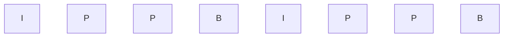

## Modele barw. 
### Model RGB
Model RGB bazuje na założeniu, że dostępne są trzy barwy podstawowe R, G i B. Wszystkie barwy, które można uzyskać za pomocą mieszania tych składowych, są reprezentowane przez punkty należące do sześcianu jednostkowego zdefiniowanego w układzie współrzędnych R, G, B.

W wierzchołkach sześcianu są reprezentowane barwy R,G,B,C,M,Y oraz czarna K (blac**K**) i biała W (**W**hite). Na przekątnej łączącej wierzchołki K i W znajdują się odcienie szarości.

Z punktu widzenia zastosowań grafiki komputerowej model RGB jest modelem dyskretnym. Każda ze składowych może być reprezentowana za pomocą słów o pewnej długości. W szczególności, jeżeli każda składowa jest reprezentowana przez słowo 8. bitowe, to barwny punkt jest reprezentowany przez 24 bity.

> [!info] Barwę uzyskuje się na zasadzie mieszania addytywnego polegającego na dodawaniu składowych.
#### sRGB
Przestrzeń odwzorowania kolorów w układzie RGB stanowiąca wspólny standard dla urządzeń – monitorów, skanerów, drukarek, aparatów cyfrowych. W tym standardzie informacja o każdym ze składowych kolorów jest przechowywana w 8-bitowej liczbie naturalnej.

sRGB to obecnie międzynarodowy standard określający najmniejszy wymagany zbiór obsługiwanych kolorów.
### Model HSV
W modelu HSV parametr H (od. ang. Hue) określa odcień barwy wyrażany w stopniach od 0º do 360º, parametr S (od ang. Saturation) określa nasycenie wyrażane w skali od 0 do 1 albo w procentach od 0% do 100%. Parametr V (od ang. Value) określa jasność (wartość) w skali od 0 (dla czerni) do 1 (dla bieli).

W modelu HSV na obwodzie dowolnego przekroju poziomego leżą barwy nasycone, wewnątrz przekroju znajdują się barwy nienasycone a o jasności barw decyduje odległość przekroju od punktu K reprezentującego barwę czarną. Na osi V znajdują się odcienie szarości.

Korzystając z modelu HSV można stosunkowo łatwo dobierać składowe H, S i V określające pożądany kolor. W tym celu można najpierw określić odcień barwy H a następnie dobrać wartości nasycenia S i jasności H. W tym sensie model HSV jest uważany za model intuicyjny.
### Model CMY
Model CMY ma podobne cechy jak model RGB. Jest on również reprezentowany za pomocą jednostkowej kostki sześciennej, z tym że w układzie współrzędnych C,M,Y.

Model CMY jest modelem subtraktywnym (różnicowym) i jest wykorzystywany głównie w drukarstwie. Barwa wydrukowana na przykład na papierze i obserwowana przez człowieka powstaje w wyniku odjęcia od światła białego części widma pochłanianej przez naniesione farby.

> [!info] Jest to model subtraktywny, ponieważ nakładanie na siebie filtrów powoduje odjęcie światła i zapisanie jedynie informacji pozostałej.
#### Barwa K

W praktyce stosowany jest model CMYK, w którym ze względów praktycznych dodatkowo uwzględnia się barwę czarną — dzięki temu uzyskuje się lepszą czerń niż w przypadku uzyskiwania czerni ze składowych C, M i Y.
### Układ CIE XYZ
Został opracowany w 1931 roku przez Międzynarodową Komisję Oświetleniową CIE System CIE XYZ wykorzystuje trzy **fikcyjne barwy podstawowe** x, y i z ($x+y+z=1$), które są nieujemne na całym zakresie fal. Składowa y zawiera informację o strumieniu światła, a składowe x i z zawierają wyłącznie informację o barwie.

> [!abstract] Za pomocą X, Y, Z można przedstawić każdy kolor, który może zostać zaobserwowany przez człowieka.
#### Funkcje dopasowania barwy

> [!info] Funkcje dopasowania barw pokazujące, jaka ilość każdej z trzech barw podstawowych jest potrzebna do dopasowania wszystkich fal w widmie widzialnym.

Istnieją barwy, których nie da się uzyskać poprzez addytywne zmieszanie barw – niektóre składowe musiałyby mieć wartości ujemne.
#### Wykres chromatyczności
W wykresie chromatyczności na części krzywoliniowej obwodu rozmieszczone są wszystkie barwy widmowe nasycone.

W środkowej części wykresu ($x=0.33; y=0.33;z=0.33$) znajduje się punkt W reprezentujący barwę białą.

We wnętrzu wykresu znajdują się barwy nienasycone. W efekcie wykres reprezentuje wszystkie barwy widzialne (z dokładnością do wartości luminancji).
- Barwy spektralne — znajdują się na obwodzie modelu, pochodzą z rozszczepienia światła.
- Barwy niespektralne — znajdują się na płaszczyźnie.

Umiejscowienie barw:
- barwy nasycone — obrzeże płaszczyzny,
- barwy nienasycone — na odcinku między bielą a barwą nasyconą,
- barwy dopełniające — barwy, które po zmieszaniu dają barwę białą:
    - barwy dopełniające leżą na odcinku pomiędzy dwoma punktami na płaszczyźnie, który przechodzi przez punkt symbolizujący barwę białą,
    - aby otrzymać biel, mieszamy barwy dopełniające w proporcjach odwrotnie proporcjonalnych do odległości do bieli — im bliżej bieli, tym więcej tej barwy wykorzystujemy do mieszanki.
## Techniki cieniowania (shadery). 
#### Cieniowanie płaskie
W najprostszym przypadku można ograniczyć się do cieniowania płaskiego, polegającego na tym, że każdy wielokąt aproksymujący powierzchnię boczną obiektu jest pokrywany jednolitą barwą.

Jasność poszczególnych ścianek cieniowanego obiektu wyznacza się na podstawie kąta pomiędzy powierzchnią ściany a kierunkiem padania światła, koloru bazowego ściany oraz intensywności światła.

Podstawową zaletą cieniowania płaskiego jest wysoka szybkość renderowania. Przede wszystkim wynika to z potrzeby wykonania tylko jednego obliczenia na każdą ścianę

Wadą cieniowania płaskiego jest to, że każda ściana modelu ma jednolitą barwę, co sprawia wrażenie występowania kantów i płaskich powierzchni; jest to tym bardziej zauważalne, im mniej złożony jest model.
#### Cieniowanie gładkie
##### Cieniowanie Gourada
Jeżeli zależy nam, by ukryć siatkową strukturę powierzchni, można zastosować prostą zasadę interpolowania jasności, znaną jako **cieniowanie Gourauda**.

>[!info] _Interpolacja_ jest to metoda numeryczna, która polega na wyznaczaniu przybliżonych wartości.

Cieniowanie Gourauda oblicza oświetlenie **dla wierzchołków wielokąta** i następnie liniowo interpoluje wartości oświetlenia we wszystkich pikseli wielokąta. 

Pierwszym krokiem podczas cieniowania Gourauda jest obliczenie wektorów normalnych do wierzchołków tychże wielokątów. Na tej podstawie możliwe jest obliczenie kąta padania światła w danym miejscu siatki wielokątów.

W następnym kroku cieniowane są wszystkie wielokąty. Każdy wielokąt jest cieniowany najpierw wzdłuż krawędzi metodą interpolacji liniowej (w tym przypadku interpolowana jest jasność padającego światła), a następnie wzdłuż kolejnych wierszy (również wykorzystując interpolację liniową).
##### Cieniowanie Phonga
Technika cieniowania wielokątów, w której interpolowany jest wektor normalny do powierzchni. Dla każdego przetwarzanego piksela jest wyznaczany wektor normalny, a następnie stosuje się wybrany model oświetlenia (np. oświetlenie Phonga, Lamberta, Blinna lub inne) w celu określenia koloru piksela.

>[!info] Oswietlenie Phonga
> Model ten przyjmuje, że powierzchnia obiektu jest pokryta bardzo cienką przezroczystą warstwą, na której zachodzi odbicie zwierciadlane, tzn. światło nie zmienia swojej barwy, natomiast na powierzchni znajdującej się pod tą warstwą następuje odbicie rozproszone, które zabarwia światło na kolor przypisany do obiektu.
> 
> Przyjmuje się, że maksymalne odbicie zwierciadlane zachodzi, gdy kąt pomiędzy promieniem odbitym a kierunkiem do obserwatora jest równy zero. Gdy kąt ten jest większy od zera, wówczas odbicie zwierciadlane bardzo szybko słabnie.
##### Ray tracing (śledzenie promieni)
W **metodzie śledzenia promieni** promienie prowadzone są od obserwatora przez każdy piksel ekranu, a śledzenie ich biegu jest kontynuowane promień odbity od danego obiektu może trafić w kolejny obiekt, odbić się znowu itd.

Dzięki odwrotnemu śledzeniu promieni, od oka do źródła światła, a nie ze źródła światła do oka, rozpatrywane są tylko te promienie światła, które docierają do oka odbiorcy i tworzą obraz na ekranie komputera. Unika się w ten sposób niemożliwej do zrealizowania w praktyce analizy wszystkich promieni wychodzących ze źródła światła, z których tylko bardzo nieliczne docierają do obserwatora.
###### Działanie algorytmu
Pierwszym etapem w algorytmie śledzenia promieni jest generacja promieni w punkcie obserwacji i poprowadzenie ich przez każdy piksel ekranu w kierunku sceny. Te promienie są nazywane **promieniami pierwotnymi** (_ang.: primary ray_).

Kolejnym etapem jest znajdowanie punktów zderzenia się promienia z obiektami na scenie - testowany jest każdy obiekt.
- W przypadku gdy do przecięcia nie dochodzi, promień wychodzi poza scenę i piksel na ekranie przybiera kolor tła. 
- Jeżeli zaś przecięcie nastąpi, spośród możliwych punktów przecięcia wybierany jest punkt najbliższy obserwatorowi. W miejscu zderzenia się promienia z obiektem powstają **promienie wtórne** (_ang.: secondary rays_), które w zależności od właściwości obiektu (przezroczystość, współczynnik odbicia) biegną dalej zgodnie z zachowaniem praw odbicia i załamania.

Promienie wtórne traktowane są jak promienie pierwotne: również są testowane z innymi obiektami znajdującymi się na scenie i podobnie jak promienie pierwotne mogą być źródłem kolejnych promieni wtórnych. Proces generowania promieni wtórnych trwa, dopóki wszystkie promienie nie wyjdą poza scenę (trafią w umowne tło) lub algorytm nie osiągnie odpowiedniego poziomu rekurencji.

Oświetlenie obiektu w danym punkcie pochodzi nie tylko z lokalnego oświetlenia tego punktu przez źródła światła, ale dodaje się do niego oświetlenie pochodzące z promieni wtórnych, które znowu jest sumą oświetlenia lokalnego i oświetlenia pochodzącego z kolejnych promieni wtórnych itd. W ten sposób uzyskuje się **efekty wzajemnych, wielokrotnych odbić** obiektów, czego nie da się uzyskać bez rekurencyjnego algorytmu.
## Metody kompresji w standardzie MPEG.
Kompresja obrazów ruchomych jest koniecznością ze względu na wielkość plików wideo.
Bardzo popularnym standardem kompresji obrazów ruchomych jest MPEG, opracowany przez Moving Pictures Expert Group. MPEG jest częścią International Standards Organisation i odpowiada za cyfrową kompresję audio i wideo.

Użycie standardów MPEG pozwala na kompresję w stosunku od 50:1 do 200:1.

Kompresję obrazów ruchomych MPEG opracowano w kilku wersjach:
- MPEG-1: przeznaczony do CD-I i Video-CD, pozwala na transmisję 1.5 Mbps,
- MPEG-2: standard dla TV cyfrowej i DVD (Digital Video Disc). Jest to zaawansowana wersja layer-1, z możliwością kodowania obrazów z przeplotem; 4 Mbps,
- tzw. MP3: format kompresji audio,
- MPEG-4: standard przewidywany do pokonania problemów z wielością standardów syntezy audio i wideo; przewidziano takie udoskonalenia jak zastosowanie sztucznej inteligencji do rekonstrukcji obrazu.

Techniki kompresji zastosowane w MPEG to:
- Discrete Cosine Transform (DCT),
- Kwantyzacja,
- **Kodowanie Huffmana** - Kodowanie Huffmana jest techniką kodowania bezstratnego, która jest często używana w MPEG do dalszej redukcji rozmiaru danych. Ta technika zakłada, że częściej występujące symbole mają krótsze sekwencje bitów, podczas gdy rzadziej występujące symbole mają dłuższe sekwencje. Kodowanie Huffmana jest stosowane do danych po kwantyzacji, aby dalej redukować rozmiar strumienia bitowego
- **Kodowanie predykcyjne** - W MPEG, kodowanie predykcyjne jest używane do obliczenia różnic między ramkami i kodowania tylko tych różnic. To pozwala na dalszą redukcję rozmiaru danych, ponieważ zamiast kodować każdą ramkę osobno, koduje się jedynie zmiany między ramkami. Technika ta jest szczególnie skuteczna, gdy ramki wideo są podobne do siebie, co jest często prawdą w filmach i klipach wideo.
- Predykcja dwustronna - na podstawie obrazów poprzednich i następnych.
### Ramki w MPEG
W Kompresji MPEG mamy **3 rodzaje ramek** (klatek) – nazywane GOP (group of pictures):
- Ramki odniesienia I (inter) – niezależne od pozostałych ramek
- Ramki P (predictive) – reprezentują różnicę między bieżącą ramką a ramką odniesienia („przewidywane obrazy”, mniej informacji niż w ramkach B)
- Ramki B (bidirectional) – mają dwie ramki odniesienia – wcześniejsza i późniejsza (koduje różnice między dwoma sąsiednimi klatkami)

Ramki P i B zawierają informacje o ruchu fragmentów ramki odniesienia – wyliczany jest wektor ruchu dla tych fragmentów, na jego podstawie konstruowana jest klatka P, która jest kodowania JPEG-iem.
Zazwyczaj nie ma dużych różnic pomiędzy następnymi klatkami nagrania, dlatego w MPEG kodujemy tylko zmiany między ustalonymi ramkami odniesienia.

## Efekt aliasingu i metody jego zwalczania. Aliasing a częstotliwość  próbkowania.
### Aliasing w grafice
Aliasing w grafice komputerowej to zjawisko zniekształcenia obrazu w wyniku zbyt małej częstości jego próbkowania w procesie rasteryzacji. Jest on skutkiem skończonej rozdzielczości rastra z jakim mamy do czynienia. Rasteryzacja ta zachodzi najczęściej podczas wyświetlania obrazu na ekranie, który obecnie najczęściej jest ekranem rastrowym, ale może dotyczyć także procesu zamiany modelu opisu obrazu z wektorowego na rastrowy.  

Aby zminimalizować ten efekt stosuje się tzw. antyaliasing, który powoduje jednak, że obraz staje się w pewnym stopniu nieostry.
#### Metody antyaliasingu
##### Dwa piksele w kolumnie
Idea zastosowanej metody polega na tym, że w każdej kolumnie wybiera się dwa piksele, leżące najbliżej punktu na idealnym odcinku. Zależnie od odległości pikseli od punktu na odcinku określa się odcienie szarości tych pikseli – im piksel jest bliżej punktu na odcinku tym jest ciemniejszy. Suma odcieni szarości obu pikseli jest stała. W szczególnym przypadku, gdy jeden piksel leży dostatecznie blisko punktu na odcinku, w kolumnie jest wyświetlany jeden piksel.
##### Bezwagowe próbkowanie powierzchni
Metoda bazuje na powierzchniowej reprezentacji piksela. Rysując linie, pokrywamy jakąś część piksela. Ustawiana jasność piksela jest proporcjonalna do ilości powierzchni, którą zakrył rysowany odcinek.

Właściwości bezwagowego próbkowania powierzchni
- jasność piksela zależy od odległości odcinka od środka piksela — im odcinek jest dalej, tym jego wpływ na jasność jest mniejszy,
- odcinek nie wpływa na jasność piksela, jeśli go nie przecina,
- takie samo zakryte pole wnosi równą jasność.
### Aliasing sygnału
Ze zjawiskiem aliasingu mamy do czynienia wówczas gdy w trakcie przetwarzania analogowo-cyfrowego lub cyfrowo-analogowego w wynikowym sygnale pojawiają się zniekształcenia będące pochodną sygnałów źródłowych o częstotliwościach wyższych od częstotliwości Nyquista.

>[!info] Częstotliwość
>Jest równa częstotliwości najwyższej składowej harmonicznej (części reprezentacji sygnału), którą chcemy odtworzyć bez błędów (aliasingu) podczas odtwarzania sygnału z postaci dyskretnej do ciągłej.
>

Aby uniknąć aliasingu należy zapewnić, aby sygnał próbkowany był ograniczony pasmowo do częstotliwości Nyquista, czyli połowy częstotliwości próbkowania. Można to uzyskać przez ograniczenie widma sygnału przy pomocy filtra nazywanego **filtrem antyaliasingowym**. Filtr ten powinien mieć szerokość pasma mniejszą niż połowa częstotliwości próbkowania.
## Zasady interakcji człowiek-komputer: przedstaw i omów heurystyki  Nielsena-Molicha.
### 1. Pokazuj status systemu
System, z którym ma styczność użytkownik powinien informować go o tym, **jaka akcja się odbywa i gdzie użytkownik się znajduje**. Najprostszym przykładem, który zobrazuje tę zasadę jest potwierdzenie, że produkt został dodany do koszyka.  Warto **uprzedzać użytkownika o konsekwencjach** jego działań (np. usunięcie danych) lub zbliżających się sytuacjach (np. przepełnienie miejsca na dysku).
### 2. Zachowaj zgodność pomiędzy systemem a rzeczywistością
Produkt czy usługa powinny posługiwać się takim językiem, jaki jest **zrozumiały dla użytkownika**, a zarazem **zgody z rzeczywistością**. Przykładem są treści błędów: warto przekazać użytkownikowi jego opis np. „nie znaleziono strony, której poszukujesz” zamiast kodu błędu. 
### 3. Daj użytkownikowi pełną kontrolę
Użytkownik musi mieć możliwość „**wyjścia ewakuacyjnego**” z systemu oraz **cofnięcia** popełnionego przed chwilą **błędu**. Przykładem są przyciski "Anuluj" w kolejnych krokach formularza. 
### 4. Trzymaj się standardów i zachowaj spójność
Trzymanie się stosowanych **konwencji** i **spójny projekt** pozwolą użytkownikowi na sprawniejsze osiągnięcie celu. Spójność można rozumieć na dwóch płaszczyznach.  Pierwsza, wewnętrzna, w której dbamy, aby składowe projektu były między sobą spójne (np. to samo nazewnictwo dla tej samej funkcji czy położenie przycisków akcji). Druga, zewnętrzna, nawiązująca do stosowanych praktyk i konwencji w projektowaniu, np. zastosowaniu ikon. Nie trzeba wymyślać koła na nowo.
### 5. Zapobiegaj błędom
Projekt powinien być przygotowany w taki sposób, aby **użytkownik wiedział co ma robić i nie popełniał błędów.** Najprostszym przykładem będą podpowiedzi w formularzu z danymi. Jeśli potrzebujesz, aby użytkownik wpisał swój numer telefonu w formacie 9 cyfrowym bez spacji, napisz to w podpowiedzi pola formularza lub podaj przykład. 
### 6. Pokaż, zamiast zmuszać do pamiętania
Projekt powinien być przygotowany tak, aby użytkownik wiedział co ma zrobić. **System pomocy** powinien być zawsze **dostępny**, tak, aby użytkownik mógł z niego skorzystać, a nie musiał zapamiętywać trudnych i skomplikowanych informacji. Warto też zwrócić uwagę na możliwość łatwego powrotu do wcześniej przeglądanych treści albo zapisanie powtarzalnych informacji np. adres dostawy.
### 7. Elastyczność i efektywność
Elastyczności i efektywność odnoszą się do tego, że użytkownicy naszego systemu są bardzo różni. Będą to zarówno osoby zaawansowane, jak i mniej doświadczone, ale również osoby z niepełnosprawnościami stałymi lub czasowymi. System powinien być zaprojektowany tak, aby **każdy** z tych użytkowników mógł **zrealizować swój cel.**
### 8. Dbaj o estetykę i umiar
Systemy powinny zawierać tylko te **informacje, które są potrzebne i konieczne**, tak, aby nie odwracać uwagi użytkownika od celu, który realizuje. Zasada estetyki i umiary dotyczy zarówno warstwy wizualnej, ale przede wszystkim tego, jakie treści pojawia się w systemie i jakie procesy można w nim zrealizować.
### 9. Zapewnij skuteczną obsługę błędów
Powinniśmy informować jasno i czytelnie użytkowników jaki błąd został popełniony i co użytkownik powinien zrobić (np. w jakim formacie wpisać adres w formularzu). Unikajmy technicznych komunikatów, **pokazujmy miejsce wystąpienia błędów** i proponujmy **konstruktywne rozwiązanie.**
### 10. Zadbaj o pomoc i dokumentację
W idealnym świecie projekt powinien spełniać zasadę „Zapobiegaj błędom” i być zaprojektowany w taki sposób, aby użytkownik zawsze wiedział co ma zrobić. Świat idealny jednak nie istnieje, a użytkownicy systemów to osoby bardzo różne, dlatego **pomoc** (w tym kontekstowa) i **dokumentacja** zawsze powinny być **dostępne**.