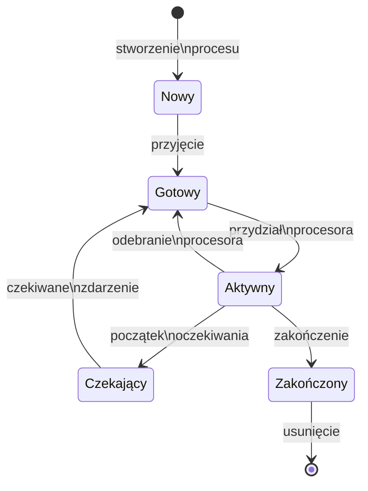

- [[#Klasyfikacja systemów operacyjnych.|Klasyfikacja systemów operacyjnych.]]
	- [[#Klasyfikacja systemów operacyjnych.#Klasyfikacja systemów operacyjnych ze względu na sposób przetwarzania|Klasyfikacja systemów operacyjnych ze względu na sposób przetwarzania]]
	- [[#Klasyfikacja systemów operacyjnych.#Klasyfikacja systemów operacyjnych ze względu na liczbę wykonywanych programów|Klasyfikacja systemów operacyjnych ze względu na liczbę wykonywanych programów]]
	- [[#Klasyfikacja systemów operacyjnych.#Klasyfikacja systemów operacyjnych ze względu na liczbę użytkowników|Klasyfikacja systemów operacyjnych ze względu na liczbę użytkowników]]
	- [[#Klasyfikacja systemów operacyjnych.#Inne rodzaje systemów operacyjnych|Inne rodzaje systemów operacyjnych]]
- [[#Problem szeregowania procesów/wątków w systemach operacyjnych.|Problem szeregowania procesów/wątków w systemach operacyjnych.]]
	- [[#Problem szeregowania procesów/wątków w systemach operacyjnych.#Stany procesu|Stany procesu]]
	- [[#Problem szeregowania procesów/wątków w systemach operacyjnych.#Planista|Planista]]
		- [[#Planista#Planista długoterminowy (albo planista zadań)|Planista długoterminowy (albo planista zadań)]]
		- [[#Planista#Planista krótkoterminowy (albo planista procesora)|Planista krótkoterminowy (albo planista procesora)]]
	- [[#Problem szeregowania procesów/wątków w systemach operacyjnych.#Planowanie procesów|Planowanie procesów]]
		- [[#Planowanie procesów#Strategie planowania|Strategie planowania]]
		- [[#Planowanie procesów#Kryteria jakości planowania|Kryteria jakości planowania]]
		- [[#Planowanie procesów#FCFS|FCFS]]
		- [[#Planowanie procesów#SJF|SJF]]
		- [[#Planowanie procesów#SRTF|SRTF]]
		- [[#Planowanie procesów#Planowanie rotacyjne|Planowanie rotacyjne]]
	- [[#Problem szeregowania procesów/wątków w systemach operacyjnych.#Wątki|Wątki]]
- [[#Problem synchronizacji procesów/wątków w programach komputerowych oraz przedstaw jakie wsparcie w tym zakresie oferują systemy komputerowe i operacyjne.|Problem synchronizacji procesów/wątków w programach komputerowych oraz przedstaw jakie wsparcie w tym zakresie oferują systemy komputerowe i operacyjne.]]
		- [[#Wątki#Problem sekcji krytycznej|Problem sekcji krytycznej]]
	- [[#Problem synchronizacji procesów/wątków w programach komputerowych oraz przedstaw jakie wsparcie w tym zakresie oferują systemy komputerowe i operacyjne.#Mechanizmy synchronizacji|Mechanizmy synchronizacji]]
		- [[#Mechanizmy synchronizacji#Semafory|Semafory]]
			- [[#Semafory#Algorytm wzajemnego wykluczania (mutex)|Algorytm wzajemnego wykluczania (mutex)]]
		- [[#Mechanizmy synchronizacji#Kolejki komunikatów|Kolejki komunikatów]]
		- [[#Mechanizmy synchronizacji#Monitory|Monitory]]
	- [[#Problem synchronizacji procesów/wątków w programach komputerowych oraz przedstaw jakie wsparcie w tym zakresie oferują systemy komputerowe i operacyjne.#Sprzętowe mechanizmy synchronizacji|Sprzętowe mechanizmy synchronizacji]]
- [[#Mechanizmy obsługi pamięci operacyjnej wykorzystywane w systemach operacyjnych.|Mechanizmy obsługi pamięci operacyjnej wykorzystywane w systemach operacyjnych.]]
	- [[#Mechanizmy obsługi pamięci operacyjnej wykorzystywane w systemach operacyjnych.#Przydział ciągły|Przydział ciągły]]
		- [[#Przydział ciągły#Fragmentacja zewnętrzna i kompaktyfikacja|Fragmentacja zewnętrzna i kompaktyfikacja]]
		- [[#Przydział ciągły#Strategie przydziału pamięci|Strategie przydziału pamięci]]
	- [[#Mechanizmy obsługi pamięci operacyjnej wykorzystywane w systemach operacyjnych.#Segmentacja|Segmentacja]]
	- [[#Mechanizmy obsługi pamięci operacyjnej wykorzystywane w systemach operacyjnych.#Stronicowanie|Stronicowanie]]
		- [[#Stronicowanie#Fragmentacja wewnętrzna|Fragmentacja wewnętrzna]]
	- [[#Mechanizmy obsługi pamięci operacyjnej wykorzystywane w systemach operacyjnych.#Segmentacja ze stronicowaniem|Segmentacja ze stronicowaniem]]
- [[#Istota mechanizmu pamięci wirtualnej - wady i zalety tego rozwiązania.|Istota mechanizmu pamięci wirtualnej - wady i zalety tego rozwiązania.]]

## Klasyfikacja systemów operacyjnych.

### Klasyfikacja systemów operacyjnych ze względu na sposób przetwarzania
W przypadku systemu **przetwarzania bezpośredniego** użytkownik wprowadza zadanie do systemu i oczekuje na wyniki. W trakcie przetwarzania jest zatem możliwa interakcja pomiędzy użytkownikiem a systemem (aplikacją).

W przypadku **przetwarzania pośredniego** zadanie jest realizowane w czasie wybranym przez system. Podczas przetwarzania zadania ingerencja użytkownika jest niemożliwa. Wszystkie dane muszą być zatem dostępne w momencie przetwarzania zadania, a jakikolwiek błąd programowy (np. niekompletność danych) oznacza konieczność wykonania zadania ponownie.
### Klasyfikacja systemów operacyjnych ze względu na liczbę wykonywanych programów
**Systemy jednoprogramowe**, zwane też jednozadaniowymi, umożliwiają uruchomienie jednego zadania użytkownika.

**Systemy wieloprogramowe** (wielozadaniowe) dostarczają mechanizm przełączania kontekstu, umożliwiając w ten sposób zachowanie stanu wykonywania określonego programu (stanu procesu), a następnie odtworzenie stanu wykonywania innego programu (w szczególności innego wykonywania tego samego programu).
### Klasyfikacja systemów operacyjnych ze względu na liczbę użytkowników
W systemach dla **jednego użytkownika** nie ma problemu autoryzacji. Mechanizmy ochrony są ograniczone w tym sensie, że nie ma potrzeby ochrony zasobów jednego użytkownika przed innymi.

System operacyjny w przypadku **wielodostępu** musi zagwarantować, że j**eden użytkownik nie jest w stanie zakłócić pracy innych użytkowników**. Jest to **problem właściwego udostępniania zasobów** oraz dostępności mechanizmów ochrony „prywatnych” zasobów jednego użytkownika przed ingerencją innego.  
### Inne rodzaje systemów operacyjnych
W **systemach czasu rzeczywistego** priorytetem jest minimalizacja czasu odpowiedzi (reakcji) lub czasu realizacji zadania, gdyż po przekroczeniu pewnego czasu wartość wyników albo jest znacznie mniejsza (np. przewidywanie kursów akcji na giełdzie) albo są one całkowicie bezużyteczne (np. prognozowanie pogody). 

**Rozproszone systemy operacyjne** zapewniają, że system komputerowy, złożony z autonomicznych jednostek przetwarzających połączonych siecią komputerową, postrzegany jest jako całość. Zasoby tego systemu udostępniane są w jednolity sposób niezależnie od ich fizycznej lokalizacji. 
## Problem szeregowania procesów/wątków w systemach operacyjnych.

>[!info] Proces to wykonujący się program. Wykonanie instrukcji jednego procesu musi być sekwencyjne, inaczej mówiąc instrukcje są wykonywane w określonej kolejności. Każdy proces ma własny _licznik instrukcji_, który wskazuje następną instrukcję do wykonania, oraz własny obszar przydzielonej mu pamięci operacyjnej. 

Pamięć operacyjna zwykle jest podzielona na cztery części (nazywane segmentami):
- **segment kodu** - zawiera instrukcje wykonywanego programu,
- **segment danych** - zawiera zmienne globalne programu,
- **stos** - jest używany do wywoływania procedur, przekazywania parametrów i wyników, oraz przechowywania zmiennych lokalnych,
- **sterta** - z tego obszaru przydzielana jest pamięć dla zmiennych dynamicznych.

Instrukcje z segmentu kodu są tylko odczytywane, natomiast zawartość pozostałych segmentów może ulegać zmianie (być zapisywana). 

### Stany procesu
W każdej chwili proces jest w jakimś _stanie_. Ten stan zmienia się w miarę postępu wykonania procesu. Oto możliwe stany:
- **nowy** - proces właśnie utworzono.
- **aktywny** - proces jest właśnie wykonywany przez procesor.
- **czekający** - proces czeka na zajście jakiegoś zdarzenia (np. wykonanie operacji wejścia-wyjścia).
- **gotowy** - proces czeka na przydzielenie mu procesora.
- **zakończony** - proces zakończył działanie.

Możliwe są następujące przejścia między stanami:

1. Proces **nowy** może przejść jedynie do stanu **gotowy**. Dzieje się tak, gdy system załaduje program do pamięci.
2. Proces **gotowy** może przejść jedynie do stanu **aktywny**. Dzieje się tak, gdy moduł systemu operacyjnego zwany planistą przydzieli temu procesowi procesor.
3. Proces **aktywny** może przejść do jednego z trzech stanów:
    - **gotowy** (gdy planista odbierze procesowi procesor),
    - **czekający** (gdy proces rozpocznie oczekiwanie na jakieś zdarzenie, np. zleci operację wejścia-wyjścia i czeka na jej wykonanie),
    - **zakończony** (gdy proces zakończy działanie).
4. Proces **czekający** może przejść jedynie do stanu **gotowy**. Dzieje się tak, gdy nastąpi oczekiwane przezeń zdarzenie, np. ukończenie operacji wejścia-wyjścia.
5. Proces **zakończony** nie może już zmienić swojego stanu.

>[!info] Planowanie procesów
Planowanie procesów polega na wskazywaniu procesu, któremu ma być w danej chwili przydzielony procesor. W systemie w każdej chwili może być aktywnych co najwyżej tyle procesów ile jest procesorów.
>
>**Kolejki planowania**
> - Kolejka zadań - znajdują się w niej wszystkie procesy w systemie.
> - Kolejka gotowych- znajdują się w niej procesy, które są gotowe do wykonania (ich stan to gotowy).
> - Kolejka do urządzenia - dla każdego urządzenia wejścia-wyjścia istnieje odrębna taka kolejka. Znajdują się w niej procesy, które czekają na wykonanie operacji wejścia-wyjścia na tymże urządzeniu.

### Planista
Selekcji procesu, który ma przejść do stanu aktywny, dokonuje odpowiedni proces systemowy. Nazywamy go _planistą_. Możemy wyróżnić dwa rodzaje planistów:
#### Planista długoterminowy (albo planista zadań)
Decyduje o tym, który z procesów ma być załadowany do pamięci i gotowy do wykonania. Swoje działania podejmuje stosunkowo rzadko (np. co kilka minut). Kontroluje on _poziom wieloprogramowości_, czyli liczbę współbieżnie wykonywanych procesów. 
#### Planista krótkoterminowy (albo planista procesora)
Decyduje o tym, który z procesów gotowych ma być wykonywany na procesorze. Swoje działania podejmuje stosunkowo często (np. co 10-100 milisekund), żeby użytkownik miał wrażenie płynnej współbieżności wszystkich działających procesów. 

### Planowanie procesów
#### Strategie planowania
Celem planowania jest maksymalizacja czasu wykorzystania procesora przy wieloprogramowości. 

Większość procesów działa w cyklu złożonym na przemian z **fazy procesora** (okresu, w którym proces wykonuje obliczenia) i **fazy wejścia-wyjścia** (okresu, w którym proces czeka na ukończenie zleconej operacji wejścia-wyjścia).

Planując przydział procesora, powinniśmy to przewidzieć tak, aby nie okazało się, że w wyniku strategii planowania np. wszystkie procesy czekają na wejście-wyjście i żaden nie jest gotowy do korzystania z procesora.

Jeśli decyzje planisty są podejmowane jedynie w następujących chwilach:
- przejście procesu aktywnego do stanu oczekiwania,
- zakończenie procesu,
to planowanie nazywamy _niewywłaszczeniowym_ (nie ma sytuacji, w której planista swoją decyzją wstrzymuje proces aktywny).

Decyzje planisty mogą być podejmowane także w takich chwilach:
- przejście procesu ze stanu oczekiwania do stanu gotowości,
- przejście procesu aktywnego do stanu gotowości.
Wówczas mówimy o planowaniu _wywłaszczeniowym_ (są sytuacje, w których planista swoją decyzją wstrzymuje proces aktywny).

#### Kryteria jakości planowania
Strategie planowania można oceniać z różnych punktów widzenia. Przyjęcie konkretnego kryterium może całkowicie zmienić naszą ocenę danej strategii. 

- **Wykorzystanie procesora** - dbaj o to, żeby procesor był jak najlepiej wykorzystywany.
- **Przepustowość** - liczba faz procesora wykonanych na jednostkę czasu. Należy ją maksymalizować.
- **Czas oczekiwania** - czas spędzony przez proces w kolejce gotowych. Najlepiej, żeby był jak najkrótszy.
- **Czas obrotu** - czas wykonywania jednej fazy procesora. Podobnie, najlepiej, żeby był jak najkrótszy. Czas obrotu jest sumą czasu oczekiwania oraz czasu wykonywania obliczeń w danej fazie procesora.
- **Czas reakcji** - czas od zajścia zdarzenia, na które proces ma zareagować, do powzięcia pierwszej reakcji. Należy go również minimalizować. 
#### FCFS
_FCFS (First-Come, First-Served)_, czyli "pierwszy przyszedł pierwszy obsłużony", to strategia szeregowania bez wywłaszczania. Procesy są wykonywane od początku do końca w takiej kolejności, w jakiej pojawiły się w kolejce gotowych.
#### SJF
_SJF (Shortest-Job-First)_, czyli "najpierw najkrótsze zadanie" to strategia, w której decyzje planisty zależą od przewidywanych długości następnych faz procesora gotowych procesów. Jest to strategia bez wywłaszczania. Gdy jakiś proces zwolni procesor, planista wybiera z kolejki gotowych ten proces, którego przewidywana długość następnej fazy procesora jest najkrótsza.
#### SRTF
_SRTF (ang. Shortest-Remaining-Time-First)_, czyli "najpierw zadanie o najkrótszym pozostałym czasie wykonania" to wersja strategii SJF z wywłaszczaniem. Wybiera się proces, którego pozostały przewidywany czas fazy procesora jest najkrótszy. Jeśli w trakcie wykonywania procesu pojawiły się inny gotowy proces, którego oczekiwany czas fazy procesora jest krótszy niż pozostały oczekiwany czas działania procesu aktywnego, to proces aktywny jest _wywłaszczany_ a w jego miejsce procesor otrzymuje nowo przybyły proces. 
#### Planowanie rotacyjne
_RR (Round-Robin)_, czyli planowanie rotacyjne, to strategia, w której każdy proces po kolei otrzymuje kwant czasu procesora do wykorzystania. Zwykle jest to około 20-100 milisekund. Żaden proces nie czeka więc dłużej na procesor niż długość kwantu razy liczba procesów.

Planowanie rotacyjne powoduje znacznie więcej przełączeń kontekstu jest więc dość kosztowną strategią. Kwant czasu musi być co najmniej o rząd wielkości większy niż czas przełączenia kontekstu. W przeciwnym wypadku prace administracyjne (biurokracja systemowa) zduszą rzeczywistą pracę wykonywaną przez system dla użytkowników.
### Wątki
W ramach procesu można powołać do życia kilka lżejszych struktur nazywanych _wątkami_ albo _procesami lekkimi_. Wątki jednego procesu są wykonywane współbieżnie. Każdy z nich ma oddzielne rejestry i stos wywołań, jednak współdzieli z innymi wątkami w ramach tego samego procesu segment danych, segment kodu, stertę, tablicę otwartych plików itp. Można powiedzieć, że proces to grupa wykonujących go wątków (przynajmniej jednego).

Korzyści ze stosowania wątków są rozmaite. Przede wszystkim wydajność: powołanie do życia wielu wątków jest znacznie tańsze niż stworzenie wielu ciężkich procesów. Wątki mogą bez ograniczeń współdzielić przestrzeń danych procesu. Gdybyśmy chcieli tak samo prosto skomunikować procesy (przez wspólny obszar pamięci), musielibyśmy skorzystać ze złożonej usługi systemu operacyjnego, jaką jest _pamięć dzielona_.
## Problem synchronizacji procesów/wątków w programach komputerowych oraz przedstaw jakie wsparcie w tym zakresie oferują systemy komputerowe i operacyjne. 
Przyczyny, dla których konieczna jest synchronizacja współpracujących procesów:
- **Procesy współdzielą pewną strukturę danych** - Zwykle wykonania operacji na tej strukturze danych nie mogą dowolnie przeplatać się współbieżnie ze sobą. Pojedyncze operacje muszą być "zatomizowane", tzn. tylko jeden proces może na raz modyfikować współdzieloną strukturę danych.
- **Wyniki działania jednego procesu stanowią dane dla innego procesu**. 
- **Procesy korzystają z pewnej wspólnej puli zasobów**, które pobierają i zwalniają wedle potrzeb. Oczekiwanie na zasoby i przydzielanie ich wymaga również synchronizacji między procesami.  
#### Problem sekcji krytycznej
Sekcja krytyczna, to fragment(y) kodu lub operacje, które nie mogą być wykonywane współbieżnie. Sekcja krytyczna jest otoczona dodatkowym kodem synchronizującym przebywanie procesów wejściowych - przed wejściem do sekcji krytycznej każdy proces musi przejść przez _sekcję wejściową_, a wychodząc przechodzi przez _sekcję wyjściową_. Dopóki jakiś proces przebywający w sekcji krytycznej nie opuści jej, inne procesy chcące wejść do sekcji krytycznej są wstrzymywane w sekcji wejściowej. 

Jeśli wiele procesów oczekuje na wejście do sekcji krytycznej, to nie jest określone w jakiej kolejności wejdą one do niej. Jednak każdy proces, który chce wejść do sekcji krytycznej ma gwarancję, że kiedyś do niej wejdzie.

### Mechanizmy synchronizacji
#### Semafory
Semafor Dijkstry jest obiektem abstrakcyjnym służącym do kontrolowania dostępu do ograniczonego zasobu. Z semaforem związany jest licznik zasobu przyjmujący wartości nieujemne, a w przypadku semafora binarnego wartości 0 lub 1. Wyróżniamy dwa rodzaje semaforów:
1. Semafor ze zbiorem procesów oczekujących – nie jest określone, który z oczekujących procesów ma być wznowiony. Nie spełnia on warunków zagłodzenia, tzn. któryś z procesów może nigdy nie wejść do sekcji krytycznej.
2. Semafor z kolejką procesów oczekujących – procesy oczekujące na semaforze umieszczane są w kolejce FIFO.
##### Algorytm wzajemnego wykluczania (mutex) 
Stanowi szczególny rodzaj semaforów binarnych. Może być zablokowany (ma wartość 1) lub odblokowany (ma wartość 0). Mutexy w odróżnieniu od semaforów posiadają pewne mechanizmy zabezpieczające.  Jeśli jakieś zadanie zablokuje mutex, to tylko ono może ten mutex odblokować. 

Takie podejście eliminuje całkowicie problem niespójności danych, w którym jedno z zadań wykona operację czekaj, aby synchronizować dostęp do jakiegoś zasobu a później inne, niezwiązane logicznie z tym zasobem, podniesie semafor. 
#### Kolejki komunikatów
Komunikaty uporządkowane są w kolejce FIFO. Dodany komunikat umieszczany jest zawsze na końcu kolejki natomiast wyjmowany jest z kolejki zawsze element umieszczony w niej najdawniej. Na kolejce wykonywać można podstawowe operacje takie jak wkładanie i wyciąganie zmiennych. Pojemność kolejki jest ograniczona. 

Istnieje możliwość zaimplementowana kolejki komunikatów z wykorzystaniem semaforów oraz odwrotnie tzn. implementowania semaforów poprzez wykorzystanie kolejki
#### Monitory
Jest strukturalnym narzędziem synchronizacji. Są to zmienne i działające na nich procedury zebrane w jednym module. Monitory definiowane są jako klasy. 

Dostęp do zmiennych monitora jest możliwy tylko za pomocą procedur monitora. W danej chwili tylko jeden proces może wykonywać procedury monitora. Gdy inny proces wywoła procedurę monitora proces ten będzie zablokowany do chwili opuszczenia monitora przez znajdujący się tam już proces. 

Istnieje możliwość wstrzymania i wznowienia procedur monitora za pomocą zmiennych warunkowych.

Procesy oczekujące na wejście do monitora są zorganizowane w kolejkę FIFO. Na zmiennych warunkowych można wykonywać operacje:
- wait – powoduje wstrzymanie procesu i wstawienie go na koniec kolejki.
- signal – powoduje wznowienie pierwszego procesu z kolejki, o ile kolejka nie jest pusta, jeżeli jest pusta, operacja nie przynosi żadnego efektu.
### Sprzętowe mechanizmy synchronizacji
Środki udostępniane przez poziom maszynowy procesora to głównie atomowy zapis oraz odczyt współdzielonych danych, określanych również jako współdzielone rejestry, czyli współdzielone komórki pamięci.

Procesor może też udostępnić bardziej złożone operacje atomowe na współdzielonych rejestrach lub bitach rejestrów. Do takiej grupy należą np. instrukcje **test & set** oraz **exchange**.

W przypadku komputera jednoprocesorowego, takiego wsparcia dostarcza np. blokowanie przerwań. Ponieważ przełączenie kontekstu może nastąpić tylko na skutek wykonania przez proces operacji systemowej, lub na skutek przerwania sprzętowego, więc zablokowanie przerwań powoduje, że ciąg instrukcji jest wykonywany niepodzielnie. 
## Mechanizmy obsługi pamięci operacyjnej wykorzystywane w systemach operacyjnych.

### Przydział ciągły
Przydział ciągły jest najprostszym z modeli zarządzania pamięcią. W modelu tym każdemu procesowi przydziela się jeden spójny fragment pamięci fizycznej. W systemie zwykle działa współbieżnie wiele procesów. Pamięć fizyczna jest więc podzielona na zajęte i wolne fragmenty.

Każdy proces widzi spójny obszar pamięci określonej wielkości. Adresy logiczne mają zakres od 0 do wielkości przydzielonego obszaru minus jeden. 

MMU (**Jednostka zarządzania pamięcią** ang.  _memory management unit_) zawiera dwa programowalne rejestry. Rejestr przemieszczenia zawiera początkowy adres fizyczny przydzielonego obszaru. Rejestr graniczny zawiera wielkość przydzielonego obszaru.
#### Fragmentacja zewnętrzna i kompaktyfikacja
W momencie uruchomienia procesu, system operacyjny musi przydzielić procesowi pamięć. Wolna pamięć fizyczna może być poszatkowana przydzielonymi już obszarami na wiele fragmentów. Może się więc tak zdarzyć, że łączna ilość wolnej pamięci będzie wystarczająca, ale nie będzie jednego spójnego obszaru, wystarczająco dużego, żeby przydzielić z niego pamięć dla procesu. Zjawisko takie nazywamy fragmentacją zewnętrzną.

Jeżeli mamy do czynienia z fragmentacją zewnętrzną, to konieczne staje się scalenie wolnych obszarów. Scalanie takie nazywamy kompaktyfikacją lub upakowaniem. Kompaktyfikacja jest kosztowna, ze względu na konieczność kopiowania dużych obszarów pamięci fizycznej. Dlatego też należy starać się unikać fragmentacji zewnętrznej. 
#### Strategie przydziału pamięci
Gdy system operacyjny przydziela procesowi obszar pamięci, to zwykle może go przydzielić z jednego z wielu obszarów wolnej pamięci. 
- **First-Fit** - jest to najprostsza możliwa strategia. Wybierany jest pierwszy (pod względem adresów) wolny obszar, który jest wystarczająco duży. 
- **Best-Fit** - wybieramy najmniejszy wolny obszar, który jest wystarczająco duży. Pomysł, który się kryje za tą strategią jest następujący: Wolny obszar jest zwykle większy niż przydzielany obszar, więc po przydzieleniu część wolnego obszaru pozostaje wolna. W przypadku strategii best-fit, taka "końcówka" jest możliwie najmniejsza. Jeśli w przyszłości nie wykorzystamy jej, to straty z powodu fragmentacji zewnętrznej będą możliwie małe. 
- **Worst-fit** - przydzielamy pamięć zawsze z największego wolnego obszaru. W przypadku tej strategii, część obszaru, która pozostaje wolna jest możliwie jak największa. Jest więc szansa, że będzie można ją jeszcze wykorzystać bez konieczności kompaktyfikacji.
### Segmentacja
Pamięć wykorzystywana przez proces, z logicznego punktu widzenia, nie stanowi jednego spójnego obszaru. Zwykle składa się z kilku segmentów. Typowe segmenty to: 
- kod programu, 
- zmienne globalne, 
- stos,
- sterta.

System operacyjny może więc przydzielać procesom pamięć nie w postaci jednego spójnego bloku, ale kilku takich bloków. Co więcej, proces może w trakcie działania prosić o przydzielenie lub zwolnienie segmentów.

Nadal mamy do czynienia z fragmentacją zewnętrzną i nadal możemy stosować kompaktyfikację. Stosujemy również te same strategie przydzielania pamięci, co w przypadku przydziału ciągłego. Jedyna różnica między segmentacją, a przydziałem ciągłym polega na tym, że proces ma dostęp do kilku segmentów, a nie tylko do jednego.

Adres logiczny składa się z dwóch części: numeru segmentu i adresu w obrębie segmentu. Budowa MMU przypomina tę dla przydziału ciągłego, z tym, że zamiast jednego rejestru początkowego i przemieszczenia mamy dwie tablice, zawierające po jednej komórce dla każdego segmentu.

Taki schemat działania MMU sugeruje, że czas dostępu do pamięci logicznej jest dwukrotnie dłuższy od czasu dostępu do pamięci fizycznej - musimy najpierw odwołać się do tablic segmentów, a dopiero potem do szukanego słowa w pamięci fizycznej. 

W praktyce stosuje się dwa ulepszenia:
- Lista segmentów jest ograniczona do kilku. Wówczas dane na temat położenia segmentów mogą być przechowywane w wyspecjalizowanych rejestrach procesora.
- Oprócz tablic segmentów mamy też mniejszą, podręczną tablicę segmentów przechowującą informacje o ostatnio używanych segmentach. Dostęp do podręcznej tablicy segmentów jest znacznie szybszy, gdyż nie znajduje się ona w pamięci operacyjnej, ale w niedużej szybkiej pamięci stanowiącej część MMU. 

Przy segmentacji procesy mogą współdzielić segmenty - ten sam segment może się pojawiać w tablicach kilku procesów. Ma to praktyczne zastosowanie, jeśli ten sam program uruchomimy kilka razy, to wszystkie tak powstałe procesy mogą mieć ten sam segment kodu. 
### Stronicowanie
Stronicowanie to rozwiązanie, w którym proces widzi spójny obszar pamięci logicznej, ale nie tworzy ona spójnego obszaru w pamięci fizycznej. Zarówno pamięć logiczna, jak i pamięć fizyczna jest podzielona na kawałki **równej** wielkości. W odniesieniu do pamięci logicznej mówimy o stronach, a w odniesieniu do pamięci fizycznej mówimy o ramkach. 

Podział pamięci logicznej na strony nie jest widoczny dla procesu. Z punktu widzenia procesu, pamięć logiczna ma spójny przedział adresów. 

MMU musi sprawdzić, czy numer strony jest poprawny i która ramka zawiera daną stronę. Służy do tego tzw. tablica stron. Tablica ta jest indeksowana numerami stron. Dla danej strony zawiera ona numer ramki, w której znajduje się dana strona.

Taki schemat działania MMU sugeruje, że każde odwołanie do pamięci logicznej wymaga dwóch odwołań do pamięci fizycznej: jednego do tablicy stron i jednego do danego słowa w pamięci fizycznej. Byłby to zbyt duży narzut na czas dostępu do pamięci. Dlatego też stosuje się dodatkowo podręczną tablicę stron. Jest to szybka pamięć asocjacyjna, w której przechowuje się numery ramek dla pewnej liczby ostatnio używanych stron. Programy charakteryzują się tzw. lokalnością, tzn. że kolejne odwołanie do pamięci z dużym prawdopodobieństwem będzie w tej samej stronie, co jedna z ostatnio używanych stron. 
#### Fragmentacja wewnętrzna
Stosując stronicowanie unikamy fragmentacji zewnętrznej. Bez względu na to jak są rozsiane po pamięci fizycznej wolne ramki, możemy z nich utworzyć spójny obszar pamięci logicznej. Nadal nie jesteśmy jednak w stanie wykorzystać całej pamięci. Jednostką przydziału pamięci jest strona/ramka. Zwykle więc część ostatniej strony pozostanie niewykorzystana. Zjawisko to nazywamy _fragmentacją wewnętrzną_. Fragmentacja wewnętrzna występuje wszędzie tam, gdzie wielkość przydzielanej pamięci musi być wielokrotnością pewnej większej jednostki. Fragmentację wewnętrzną można zmniejszyć zmniejszając wielkość strony. To jednak oznacza zwiększenie rozmiaru tablicy stron. Wybierając wielkość stron należy wziąć pod uwagę zarówno straty związane z fragmentacją wewnętrzną, jak i straty związane z przechowywaniem tablicy stron.
### Segmentacja ze stronicowaniem
Segmentacja ze stronicowaniem stanowi połączenie technik segmentacji i stronicowania. Z punktu widzenia procesu, pamięć logiczna składa się z szeregu segmentów. Jednak poszczególne segmenty nie są rozmieszczone w pamięci fizycznej w spójny sposób. Są one dzielone na strony i każda strona może być pamiętana w dowolnej ramce. Tak więc adres logiczny składa się z numeru segmentu i adresu w obrębie segmentu. Na podstawie numeru segmentu można wyznaczyć tablicę stron określającą rozmieszczenie stron tworzących segment.

Dzięki połączeniu technik segmentacji i stronicowania, możemy z jednej strony przydzielać procesom wiele segmentów, czy współdzielić segmenty, a z drugiej strony unikamy fragmentacji zewnętrznej.
## Istota mechanizmu pamięci wirtualnej - wady i zalety tego rozwiązania.

**Pamięć wirtualna** oznacza oddzielenie pamięci fizycznej od pamięci logicznej dostępnej użytkownikowi. U podstaw tej idei leży obserwacja, że w każdej chwili tylko część pamięci procesu musi znajdować się w pamięci operacyjnej komputera -- ta część, która akurat jest używana przez proces. Pamięć logiczna może być więc większa niż fizyczna, wystarczy że nie używane w danej chwili obszary pamięci logicznej zostaną przeniesione na pamięć drugorzędną, np. na dysk. Taka pamięć drugorzędna używana do "udawania" pamięci operacyjnej jest nazywana obszarem wymiany.

Mechanizm pamięci wirtualnej stanowi rozszerzenie mechanizmów stronicowania lub segmentacj. Są to, odpowiednio, mechanizmy _stronicowania na żądanie_ albo _segmentacji na żądanie_. 
- W przypadku segmentacji na żądanie, tablica segmentów tłumaczy numer segmentu na spójny obszar w pamięci fizycznej lub w obszarze wymiany. 
- W przypadku stronicowania na żądanie, tablica stron tłumaczy numery stron na numery ramek lub numery bloków dyskowych w obszarze wymiany. 

Mechanizm pamięci wirtualnej umożliwia też współdzielenie przestrzeni adresowej przez wiele procesów, oraz pozwala efektywniej tworzyć procesy.

Zalety pamięci wirtualnej obejmują:
- Pozwala na obsługę większych ilości danych niż jest dostępne w fizycznej pamięci RAM. System może przechowywać więcej informacji na dysku i zarządzać dostępem do nich według potrzeb.
- Dzięki pamięci wirtualnej programy mogą być większe od dostępnej fizycznej pamięci RAM. Mechanizm swapowania danych między pamięcią RAM a dyskiem twardym pozwala na efektywne korzystanie z zasobów.
- Każdy proces ma swoje własne przestrzenie adresowe, co zapewnia izolację i ochronę danych przed innymi procesami.

Wady pamięci wirtualnej:
- Pamięć wirtualna jest wolniejsza niż fizyczna RAM, ponieważ musi stale przesyłać dane między pamięcią RAM a dyskiem twardym lub SSD, co jest wolniejsze
- Częste zapisywanie i usuwanie stron wymiany na dysku twardym może prowadzić do fragmentacji danych na dysku, co w rezultacie obniża wydajność systemu.
- Jeśli dysk twardy ulegnie awarii lub zapełni się, może to spowodować niestabilność systemu lub utratę danych, szczególnie tych, które są wstrzymane na stronach wymiany.