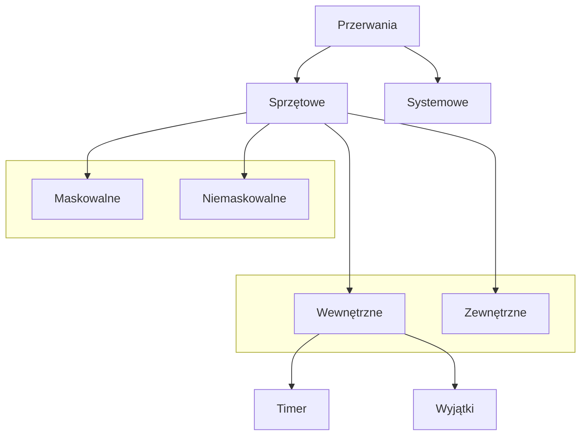

## Implementacje podstawowych elementów pasywnych (rezystorów, kondensatorów i cewek). 

>[!info] Rezystancja to stosunek napięcia (V – wolty) na krańcach materiału do prądu (A – ampery) płynącego przez ten materiał. Mierzona w Ω – omach. Rezystancja zależy od rezystywności danego materiału i jego wymiarów.

- **Rezystor, opornik** - wykorzystywany jest do ograniczenia prądu płynącego w obwodzie elektrycznym. Jest również elementem stratnym: przy przepływie prądu energia elektryczna, wydzielana w postaci ciepła, jest bezpowrotnie tracona. Rezystory składają się zwykle z korpusu izolacyjnego z wyprowadzeniami oraz z części oporowej.
- **Kondensator** - zbudowany jest z dwóch przewodników rozdzielonych izolatorem. Gromadzi ładunek elektryczny, ma określoną pojemność, mierzoną w Faradach.  
- **Cewka** - zwoje przewodnika nawinięte na rdzeń magnetyczny. Jest elementem rezystancyjnym. Jej parametrem jest indukcyjność, mierzona w Henrach. Indukcyjność to zdolność cewki do przechowywania energii w postaci pola elektromagnetycznego. Cewka gromadzi energię, wytwarza pole elektromagnetyczne.

## Filtr dolnoprzepustowy RC. Co to jest częstotliwość graniczna i pasmo przenoszenia filtru.
Filtr dolnoprzepustowy przepuszcza częstotliwości poniżej określonej częstotliwości granicznej. Składa się on tylko z dwóch elementów: rezystora i kondensatora. Stąd bierze się nazwa filtru **R** (od _resistor_) oraz **C** (od _capacitor_). Stosowany przy zamianie sygnału analogowego na cyfrowy, aby uniknąć aliasingu. 

>[!info] **Częstotliwość graniczna filtru** – wartość graniczna częstotliwości, dla której kończy się umowne pasmo przepustowe filtru.

>[!info] Pasmo przepustowe lub pasmo przenoszenia filtru to **część pasma czę- stotliwości, która jest przepuszczana przez filtr**, a wytłumianą część spektrum nazywamy pasmem zaporowym.

## Architektura harwardzka a architektura von Neumana. 

### Architektura von Neumana
Architektura von Neumanna (nazwana tak od nazwiska Johna von Neumanna) powstała w latach 40. XX wieku i opiera się na trzech podstawowych elementach, jakimi są: procesor, pamięć oraz urządzenia wejścia/wyjścia.

W tak zaprojektowanym komputerze zarówno program, jak i dane przechowywane są w tej samej pamięci, z którą połączony jest procesor (złożony z układu sterującego oraz jednostki arytmetyczno-logicznej). Pobiera on kolejne instrukcje z pamięci i wykonuje odpowiadające im rozkazy, realizując tym samym zapisany program. Do komunikacji ze światem zewnętrznym służą urządzenia wejścia/wyjścia. W przypadku komunikacji z użytkownikiem takimi urządzeniami byłyby monitor i klawiatura, jednak w wielu przypadkach (np. obwodów scalonych) będą to przede wszystkim porty wejścia/wyjścia, magistrale szeregowe itp.

Architektura von Neumanna jest szeroko stosowana w większości współczesnych komputerów.

### Architektura harwardzka
Architektura harwardzka powstała w latach 40. XX wieku. Po raz pierwszy zaproponowali ją uczeni z uniwersytetu Harvarda. Jest ona dość podobna do idei von Neumanna: tutaj również mamy procesor wykonywujący kolejne instrukcje oraz urządzenia wejścia/wyjścia. Główną różnicą jest pamięć. W architekturze harwardzkiej została podzielona na dwa osobne elementy, w pierwszym zapisywane są dane, drugi natomiast przechowuje program.

Taki układ poprawia szybkość działania całego systemu. W architekturze von Neumanna program wykonywany jest sekwencyjnie, co oznacza, że procesor, chcąc pobrać kolejny rozkaz lub daną, musi zawsze przejść do kolejnej komórki pamięci. W systemie harwardzkim procesy te wykonywane są równolegle (a właśc. niezależnie), czyli procesor może pobierać polecenia i dane, korzystając z osobnych przestrzeni adresowych.

Cechy architektury harwardzkiej sprawiają, że jest stosowana często w zaawansowanych systemach zintegrowanych (ang. **embedded**), takich jak **mikrokontrolery, procesory sygnałowe (DSP) i niektóre superkomputery**. Innymi słowy, wszędzie tam, gdzie wymagane jest równoległe przetwarzanie instrukcji i danych, na przykład w aplikacjach czasu rzeczywistego lub sterownikach.
## Sposoby obsługi zdarzeń w mikrokontrolerze.
Metody obsługi zdarzeń:
- **Przerwanie** (ang. Interrupt) - zmiana sterowania, niezależnie od aktualnie wykonywanego programu, spowodowana pojawieniem się sygnału przerwania. Pojawienie się przerwania powoduje wstrzymanie aktualnie wykonywanego programu i wykonanie przez kontroler procedury obsługi przerwania.
- **Zapytywanie** (ang. Polling) - aktywne, okresowe, próbkowanie (sprawdzanie) statusu urządzeń zewnętrznych przez kontroler. 
### Polling
- Technika polling jest najczęściej używana w kontekście obsługi urządzeń wejścia/ wyjścia. Komputer centralny cyklicznie sprawdza stan urządzenia zewnętrznego w oczekiwaniu na gotowość tego urządzenia,
- Polling znajduje zastosowanie w sytuacjach, gdy komputer łączy się z zewnętrznymi urządzeniami w celu zebrania (odświeżenia) danych, przy czym współpraca ta odbywa się w trybie offline,
- W systemach, które wymagają wykonania wielu zadań polling jest mało efektywny w stosunku do przerwań.

### Przerwania

#### Rodzaje przerwań
1. Sprzętowe:
	1. Zewnętrzne sygnał przerwania pochodzi z zewnętrznego źródła. Przerwania te służą do komunikacji z urządzeniami zewnętrznymi. Są to przerwania nieregularne.
	2. Wewnętrzne
		1. pochodzące od timera. Są to przerwania regularne występujące w określonym cyklu kontrolowanym przez zegar.
		2. Przerwania od układów kontrolujących pracę systemu - o najwyższym priorytecie. Sygnalizują stan pracy jak
			1. zanik zasilania,
			2. błąd/wyjątek procesora (ang. exceptions)  – zgłaszane przez procesor dla sygnalizowania sytuacji wyjątkowych (np. dzielenie przez zero)
	3. Przerwania maskowalne które można blokować i odblokować programowo,
	4. Przerwania niemaskowalne - przerwania, których nie można zablokować programowo. Są to przerwania, których wystąpienie każdorazowo powoduje bezwarunkowy skok do funkcji obsługi tego przerwania, np. reset
2. Systemowe: z kodu programu wywoływana jest procedura obsługi przerwania (do komunikacji z systemem operacyjnym).

#### Obsługa przerwania
- Procedura obsługi przerwania - ciąg rozkazów realizujących pożądaną reakcję na przerwanie,
- Program główny - sekwencja działań (rozkazów) mikroprocesora realizowanych gdy nie ma przerwań,
- Obsługa przerwania nie może wprowadzać żadnych zmian w programie głównym.

Procedura obsługi przerwania
1. Rozpoznanie przyczyny przerwania (realizacja może być sprzętowa),
2. Skasowanie przyczyny przerwania (realizacja może być sprzętowa),
3. Zablokowanie przerwania,
4. Składowanie na stosie rejestrów roboczych,
5. Właściwa obsługa przerwania,
6. Odtworzenie rejestrów roboczych ze stosu,
7. Odblokowanie przerwania,
8. Powrót do zawieszonego programu.
## Popularne interfejsy komunikacyjne w mikrokontrolerze.
Komunikacja mikrokontrolerów z urządzeniami zewnętrznymi jest realizowana za pomocą:
- Portów - port jest interfejsem pomiędzy komputerem a innym komputerem lub urządzeniami peryferyjnymi. 
	- porty sprzętowe - jest fragmentem sprzętu umożliwiającego podłączenie urządzeń zewnętrznych i wymianę informacji pomiędzy nimi a kontrolerem,
	- porty programowe (ang. software port) - jest wirtualnym (logicznym) połączeniem, które może być używane przez programistów do bezpośredniej wymiany danych (z pominięciem plików wymiany lub innych struktur przechowujących tymczasowo dane) np. porty TCP, UDP.
- Łącz równoległych - przesyłają kilka bitów równolegle.  
- Łącz szeregowych - przesyłają bit po bicie.  

Port równoległy - dane przesyłane są równocześnie kilkoma przewodami, np. LPT - drukarki.  

Port szeregowy - np. USB, USART - RS232 - może być synchroniczny i asynchroniczny. 1 ramka przesyła 5-9 bitów, ma bit startu, bit stopu, opcjonalnie kontrolny bit parzystości.